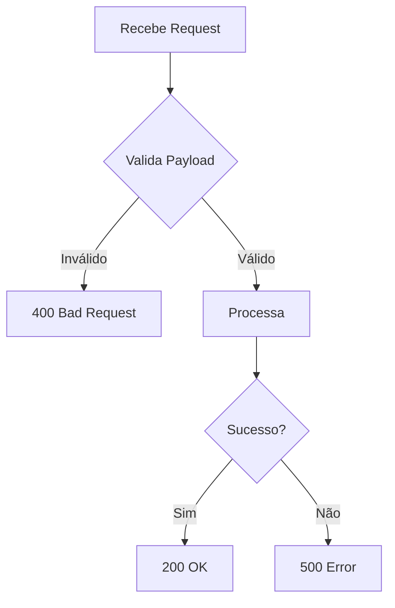

# Edge Function: [function-name]

## Propósito

[Descrição em 1-2 linhas do que a função faz]

## Endpoint

- **Método:** POST | GET
- **URL:** `/functions/v1/[function-name]`

## Entradas

```json
{
  "campo1": "string - Descrição do campo",
  "campo2": "number - Descrição do campo (opcional)"
}
```

## Saídas

### Sucesso (200)
```json
{
  "status": "success",
  "data": {}
}
```

### Erro (400/500)
```json
{
  "status": "error",
  "error": "Mensagem de erro"
}
```

## Dependências

- `_shared/modulo-x.ts` - Descrição
- `_shared/modulo-y.ts` - Descrição

## Configurações (configuracoes_sistema)

| Chave | Tipo | Descrição |
|-------|------|-----------|
| `chave_config` | string | Descrição da configuração |

## Autenticação

- [ ] Requer JWT válido
- [ ] Aceita anon key
- [ ] Webhook público (sem auth)

## Rate Limiting

- Global: `X req/min`
- Por telefone: `Y req/min`

## Erros Comuns

| Código | Causa | Solução |
|--------|-------|---------|
| 400 | Payload inválido | Verificar campos obrigatórios |
| 401 | Token inválido | Renovar autenticação |
| 429 | Rate limit | Aguardar janela de tempo |
| 500 | Erro interno | Verificar logs |

## Exemplos

### cURL
```bash
curl -X POST 'https://cvcdweqybgfxywcelriq.supabase.co/functions/v1/[function-name]' \
  -H 'Authorization: Bearer [TOKEN]' \
  -H 'Content-Type: application/json' \
  -d '{"campo1": "valor"}'
```

### TypeScript
```typescript
const { data, error } = await supabase.functions.invoke('[function-name]', {
  body: { campo1: 'valor' }
});
```

## Fluxo Interno



## TODOs

- [ ] TODO 1
- [ ] TODO 2

## Histórico de Mudanças

| Data | Versão | Descrição |
|------|--------|-----------|
| YYYY-MM-DD | 1.0 | Versão inicial |

## Autores

- Sofia Team
