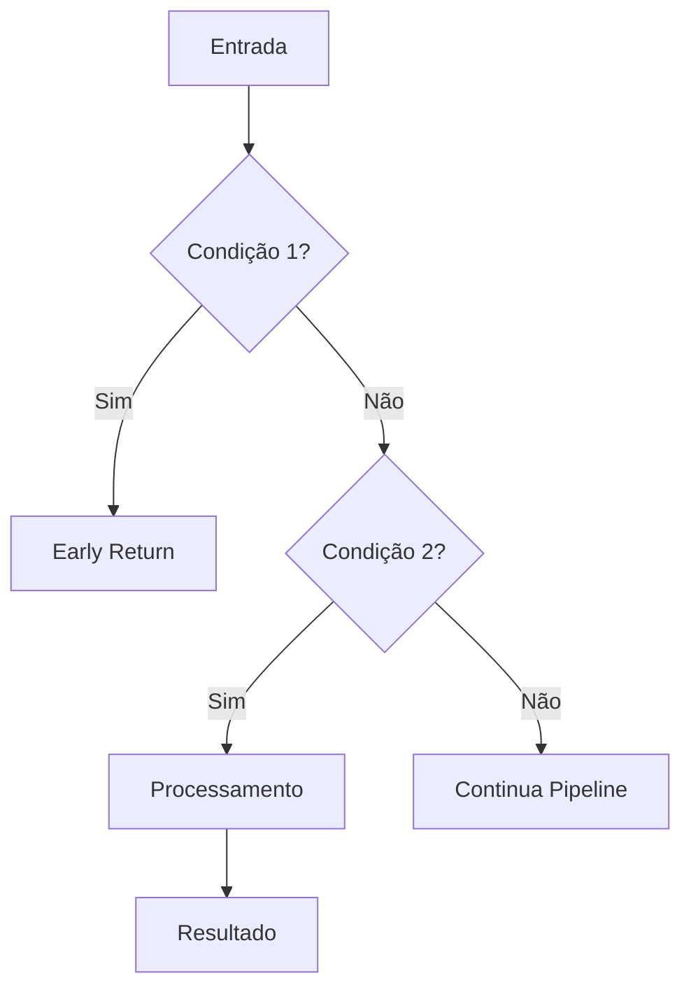

# Módulo: [nome-da-fase]

## Propósito

[Descrição em 2-3 linhas do que o módulo faz]

## Fase no Pipeline

- **Número da Fase:** X
- **Tipo:** [Determinístico | Híbrido | LLM-Based]
- **Layer:** [Initialization | Hard Stops | Fast-Paths | Intake | Context | Reasoning | Response]
- **Prioridade:** [Alta | Média | Baixa]

## Interface

### Context (Entrada)

| Campo | Tipo | Obrigatório | Descrição |
|-------|------|-------------|-----------|
| `supabase` | `SupabaseClient` | ✅ | Cliente Supabase para DB |
| `conversaId` | `string` | ✅ | ID da conversa ativa |
| `phone` | `string` | ✅ | Telefone do cliente |
| `messageText` | `string` | ✅ | Texto da mensagem |
| `...` | `...` | ... | ... |

### Result (Saída)

| Campo | Tipo | Descrição |
|-------|------|-----------|
| `handled` | `boolean` | Se a fase retornou early |
| `response` | `Response?` | HTTP response se handled=true |
| `...` | `...` | ... |

## Fluxo Interno



## Dependências

| Módulo | Descrição |
|--------|-----------|
| `_shared/modulo-x.ts` | Descrição do que é usado |
| `_shared/modulo-y.ts` | Descrição do que é usado |

## Configurações Dinâmicas

| Tabela | Chave | Descrição |
|--------|-------|-----------|
| `configuracoes_sistema` | `chave_config` | Descrição da configuração |

## Condições de Early Return

| Condição | Response Status | Descrição |
|----------|-----------------|-----------|
| Condição A | `status_a` | Quando isso acontece... |
| Condição B | `status_b` | Quando aquilo acontece... |

## Exemplos de Uso

### Uso Básico

```typescript
import { executePhase, type PhaseContext, type PhaseResult } from './phase.ts';

const ctx: PhaseContext = {
  supabase,
  conversaId: '...',
  phone: '5511999999999',
  messageText: 'Olá',
};

const result: PhaseResult = await executePhase(ctx);

if (result.handled) {
  return result.response;
}
// Continua para próxima fase
```

### Com Verificação

```typescript
import { executePhase, shouldExecutePhase } from './phase.ts';

if (shouldExecutePhase(conversa)) {
  const result = await executePhase(ctx);
  // ...
}
```

## Testes

```typescript
// Exemplo de teste
Deno.test('should handle condition A', async () => {
  const ctx = { /* ... */ };
  const result = await executePhase(ctx);
  assertEquals(result.handled, true);
  assertEquals(result.status, 'status_a');
});
```

## Métricas e Observabilidade

- **Log prefix:** `[PHASE_NAME]`
- **Métricas importantes:**
  - Taxa de early return
  - Tempo de execução
  - Erros por tipo

## Histórico de Mudanças

| Data | Versão | Descrição |
|------|--------|-----------|
| YYYY-MM-DD | 1.0 | Versão inicial |

## Notas de Implementação

- Nota 1
- Nota 2

---

**Autor:** Sofia Team  
**Última atualização:** YYYY-MM-DD
