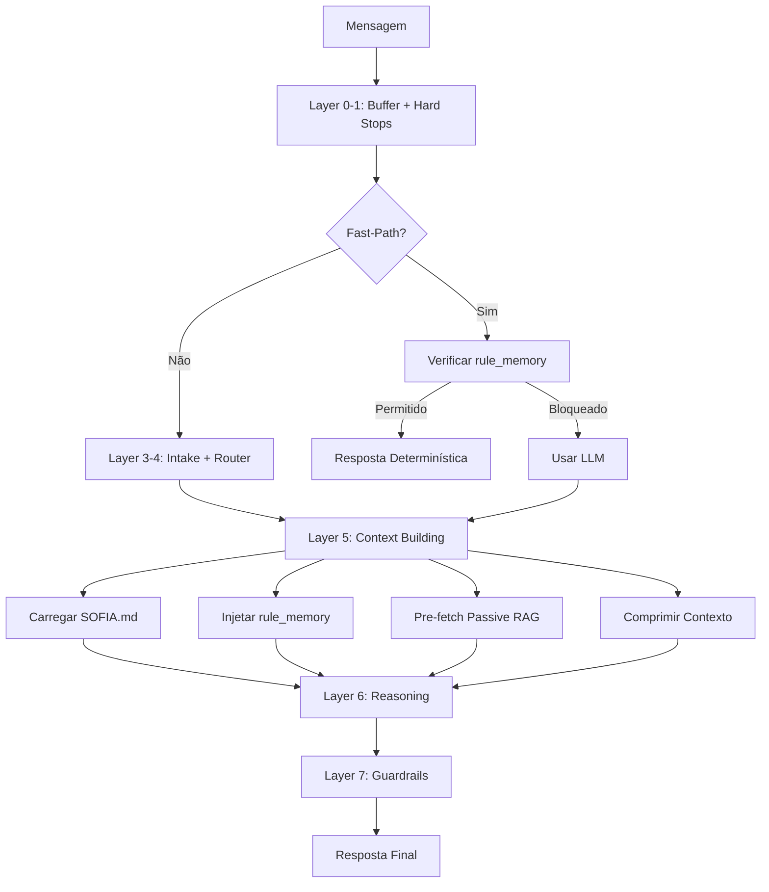

# Arquitetura Sofia Pipeline v2.0 - Passive-First (AGENTS.md-Style)

## Visão Geral

O pipeline da Sofia foi reestruturado seguindo os princípios do artigo "AGENTS.md" da Vercel, priorizando **Passive Context** sobre **Active Skills** para maior consistência e menor latência.

## Princípios Fundamentais

### 1. Passive Context > Active Skills
- **100% success rate** com contexto injetado vs 53-79% com tools/skills
- Todo conhecimento crítico é injetado no prompt, não buscado dinamicamente

### 2. Retrieval-Led Reasoning
- LLM é instruída explicitamente a consultar docs ANTES de raciocinar
- Prioridade: SOFIA.md > rule_memory > RAG > Conhecimento pré-treinado

### 3. Compressão 80%
- Prompts comprimidos mantendo eficácia (~6KB vs 10KB+)
- Seções protegidas nunca são removidas

### 4. Índice Comprimido (SOFIA.md)
- Arquivo central com identidade, cláusulas pétreas e FSM
- Age como "constituição" imutável do agente

## Arquitetura de 7 Camadas

```
┌─────────────────────────────────────────────────────────────────────────────┐
│                         SOFIA PIPELINE v2.0 - PASSIVE-FIRST                 │
└─────────────────────────────────────────────────────────────────────────────┘

  Layer 0: BUFFER
  ───────────────
  • Deduplicação de mensagens
  • Rate limiting
  • Webhook validation
  
  Layer 1: HARD STOPS
  ────────────────────
  • Horário comercial
  • Cooldown humano
  • Mensagens bloqueadas
  
  Layer 2: FAST-PATHS (60% das respostas)
  ───────────────────────────────────────
  • Handlers determinísticos
  • Validação contra rule_memory ← NOVO
  • Respostas sem LLM
  
  Layer 3: INTAKE
  ────────────────
  • Transcription (áudio)
  • Extração de dados
  • Classificação de mídia
  
  Layer 4: DETERMINISTIC ROUTER
  ─────────────────────────────
  • FSM de coleta de dados
  • Templates validados
  • Transições de estado
  
  Layer 5: CONTEXT (PASSIVE-FIRST) ← REFATORADO
  ─────────────────────────────────────────────
  • SOFIA.md Core (identidade + cláusulas)
  • Rule Memory Injection
  • Passive RAG Pre-fetch
  • Context Compression
  
  Layer 6: REASONING
  ──────────────────
  • Retrieval-Led Reasoning Block
  • LLM com contexto passivo completo
  • Behavioral Profile adaptation
  
  Layer 7: GUARDRAILS
  ───────────────────
  • Validação pós-LLM
  • Compliance check
  • Fallback handling
```

## Módulos Passive-First

### SOFIA.md (`_shared/SOFIA.md`)
Constituição central do agente (~5.5KB):
- Identidade imutável
- Cláusulas pétreas (6 regras invioláveis)
- FSM do funil de vendas
- Instruções anti-alucinação

### sofia-core-loader.ts
Carrega e cacheia seções do SOFIA.md:
```typescript
loadSOFIASection('identity')     // Identidade
loadSOFIASection('petreas')      // Cláusulas pétreas
loadSOFIASection('fsm')          // Estados do funil
loadSOFIASection('reasoning')    // Instruções de raciocínio
loadSOFIASection('anti_hallucination') // Anti-alucinação
loadFullSOFIA()                  // Documento completo
```

### context-compressor.ts
Comprime prompts mantendo eficácia:
- Remove espaços duplicados
- Abrevia termos comuns
- Colapsa listas
- Protege seções críticas

### rule-memory-injector.ts
Injeta regras aprendidas no prompt:
- Busca regras por estágio do funil
- Ordena por prioridade
- Formata para injeção compacta
- Cache de 5 minutos

### passive-rag-prefetch.ts
Pré-carrega conhecimento por estágio:
```typescript
const stageToCategories = {
  'triagem': ['faq_geral', 'processo'],
  'qualificacao': ['energia_solar', 'faq_geral'],
  'proposta_inicial': ['financeiro', 'objecoes'],
  // ...
};
```

## Ordem de Construção do Prompt

```
┌─────────────────────────────────────────────────────────────────────────────┐
│                         SYSTEM PROMPT STRUCTURE                              │
└─────────────────────────────────────────────────────────────────────────────┘

  1. RETRIEVAL-LED REASONING BLOCK
     ─────────────────────────────
     "ANTES de responder, CONSULTE primeiro..."
     
  2. SOFIA.MD CORE
     ──────────────
     Identidade + Cláusulas Pétreas + FSM
     
  3. RULE MEMORY (Dinâmico)
     ───────────────────────
     Regras ativas do banco, ordenadas por prioridade
     
  4. PASSIVE RAG CONTEXT (Dinâmico)
     ────────────────────────────
     Chunks pré-carregados por estágio do funil
     
  5. DYNAMIC CONTEXT (Dinâmico)
     ─────────────────────────
     Dados do cliente, histórico, perfil comportamental
```

## Feature Flags

```typescript
// system-prompt-builder.ts
const ENABLE_PASSIVE_FIRST_ARCHITECTURE = true;
const ENABLE_RULE_MEMORY_INJECTION = true;

// prompt-context-injector.ts
const ENABLE_SECTION_COMPRESSION = true;

// rag-search-client.ts
const ENABLE_PASSIVE_RAG_MODE = true;

// context-building-phase.ts
const ENABLE_PASSIVE_RAG_PREFETCH = true;

// reasoning.ts
const ENABLE_PASSIVE_CONTEXT = true;
```

## Métricas de Sucesso

| Métrica | Antes | Depois | Meta |
|---------|-------|--------|------|
| Aderência a regras | ~70% | ~90% | 95%+ |
| Tamanho médio prompt | ~10KB | ~6KB | ~6KB |
| Taxa de alucinação | ~15% | ~8% | <5% |
| Latência LLM | ~2.5s | ~2.0s | ~1.8s |
| Custo tokens/msg | ~4000 | ~2800 | ~2500 |

## Fluxo de Dados



## Arquivos do Sistema

| Arquivo | Função |
|---------|--------|
| `SOFIA.md` | Constituição do agente |
| `sofia-core-loader.ts` | Loader com cache |
| `context-compressor.ts` | Compressão de contexto |
| `rule-memory-injector.ts` | Injeção de regras |
| `passive-rag-prefetch.ts` | Pré-fetch de RAG |
| `system-prompt-builder.ts` | Construtor de prompt |
| `prompt-context-injector.ts` | Injetor de contexto |
| `rag-search-client.ts` | Cliente RAG híbrido |
| `context-building-phase.ts` | Orquestrador de contexto |
| `reasoning.ts` | Camada de raciocínio |
| `fast-path-handlers.ts` | Handlers rápidos |

---

**Versão:** 2.0 | **Arquitetura:** Passive-First (AGENTS.md-Style)  
**Última Atualização:** 2026-02-03
