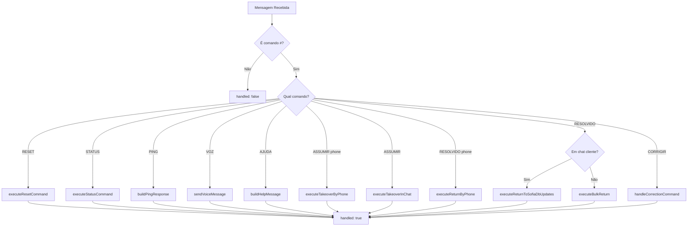

# Módulo: Operator Phase

## Propósito

Processa todos os comandos de operador enviados via WhatsApp, permitindo que atendentes humanos assumam conversas, devolvam para a Sofia, testem funcionalidades e obtenham status do sistema.

## Fase no Pipeline

- **Número da Fase:** 1
- **Tipo:** Determinístico
- **Layer:** Hard Stops
- **Prioridade:** Alta

## Interface

### Context (Entrada)

| Campo | Tipo | Obrigatório | Descrição |
|-------|------|-------------|-----------|
| `supabase` | `SupabaseClient` | ✅ | Cliente Supabase |
| `phone` | `string` | ✅ | Telefone do remetente |
| `phoneDigits` | `string` | ✅ | Telefone apenas dígitos |
| `messageText` | `string` | ✅ | Texto da mensagem |
| `chatappChatId` | `string` | ✅ | ID do chat Z-API |
| `clienteNome` | `string \| null` | ❌ | Nome do cliente |
| `agentId` | `string` | ✅ | ID do agente (sofia/maria) |
| `agentName` | `string` | ✅ | Nome do agente |
| `supervisorNome` | `string?` | ❌ | Nome do supervisor |
| `msgData` | `object` | ✅ | Dados da mensagem (fromMe, fromApi) |
| `sendWhatsAppMessage` | `function` | ✅ | Função para enviar mensagem |
| `sendVoiceMessage` | `function` | ✅ | Função para enviar áudio |

### Result (Saída)

| Campo | Tipo | Descrição |
|-------|------|-----------|
| `handled` | `boolean` | Se comando foi processado |
| `action` | `string?` | Ação executada |
| `response` | `Response?` | HTTP response |
| `conversationId` | `string?` | ID da conversa afetada |
| `clientName` | `string?` | Nome do cliente |
| `resolutionTimeSeconds` | `number?` | Tempo de resolução humana |
| `error` | `string?` | Mensagem de erro |

## Comandos Suportados

### Comandos Públicos (qualquer pessoa)

| Comando | Descrição |
|---------|-----------|
| `#RESET_TESTE` | Reseta a conversa do próprio número |
| `#STATUS_TESTE` | Mostra status da conversa atual |
| `#PING_TESTE` | Teste de conectividade |
| `#VOZ_TESTE` | Testa envio de áudio |
| `#AJUDA` | Lista todos os comandos disponíveis |

### Comandos de Operador

| Comando | Descrição |
|---------|-----------|
| `#ASSUMIR` | Assume conversa onde está digitando |
| `#ASSUMIR <phone>` | Assume conversa de número específico |
| `#MEU <phone>` | Alias para #ASSUMIR |
| `#TAKEOVER <phone>` | Alias para #ASSUMIR |
| `#RESOLVIDO` | Devolve conversa para Sofia |
| `#RESOLVIDO <phone>` | Devolve conversa de número específico |
| `#DEVOLVER` | Alias para #RESOLVIDO |
| `#RETURN` | Alias para #RESOLVIDO |
| `#CORRIGIR <texto>` | Registra correção de resposta anterior |

## Fluxo Interno



## Dependências

| Módulo | Descrição |
|--------|-----------|
| `operator-commands.ts` | Lógica de execução dos comandos |
| `continuous-improvement.ts` | Captura de feedback e correções |
| `message-templates.ts` | Cache de templates |

## Condições de Early Return

| Condição | Response Status | Descrição |
|----------|-----------------|-----------|
| Comando #RESET | `reset_executed` | Conversa resetada |
| Comando #STATUS | `status_executed` | Status retornado |
| Comando #PING | `ping_executed` | Pong enviado |
| Comando #VOZ | `voice_test_executed` | Áudio enviado |
| Comando #AJUDA | `help_executed` | Help exibido |
| Comando #ASSUMIR | `takeover_*` | Conversa assumida |
| Comando #RESOLVIDO | `return_to_sofia_*` | Conversa devolvida |
| Comando #CORRIGIR | `correction_registered` | Correção salva |

## Exemplos de Uso

### Assumir Conversa por Telefone

```typescript
// Operador digita: #ASSUMIR 5511999999999
const result = await executeOperatorPhase({
  supabase,
  phone: '5511888888888', // telefone do operador
  messageText: '#ASSUMIR 5511999999999',
  // ...
});
// result.action = 'takeover_by_phone'
// result.conversationId = 'uuid-da-conversa'
```

### Devolver Todas as Conversas

```typescript
// Operador digita #RESOLVIDO no próprio chat
const result = await executeOperatorPhase({
  supabase,
  phone: '5511888888888',
  messageText: '#RESOLVIDO',
  // ...
});
// result.action = 'return_to_sofia_bulk'
// Todas conversas do operador são devolvidas
```

## Métricas

- **Log prefix:** `[OPERATOR_PHASE]`
- **Métricas importantes:**
  - Comandos por tipo
  - Tempo de resolução humana
  - Taxa de uso de feedback

## Histórico de Mudanças

| Data | Versão | Descrição |
|------|--------|-----------|
| 2024-01-15 | 1.0 | Extração do sofia-webhook |
| 2024-02-01 | 1.1 | Adicionado #CORRIGIR |

---

**Autor:** Sofia Team  
**Última atualização:** 2026-02-03
