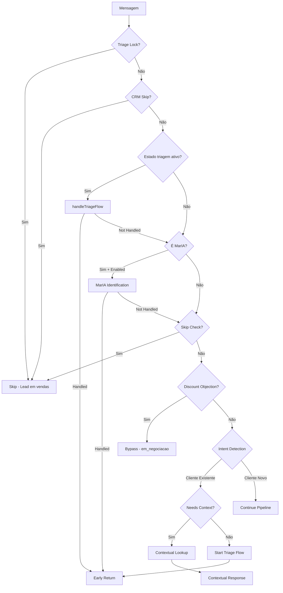

# Módulo: Triage Phase

## Propósito

Realiza a triagem inicial de mensagens para identificar clientes existentes, redirecionar para departamentos corretos (SAC, vendas), detectar recusas definitivas com alternativas, e detectar intenções que não requerem processamento LLM completo.

## Fase no Pipeline

- **Número da Fase:** 2
- **Tipo:** Híbrido (Determinístico + AI para casos ambíguos)
- **Layer:** Fast-Paths
- **Prioridade:** Alta

## Interface

### Context (Entrada)

| Campo | Tipo | Obrigatório | Descrição |
|-------|------|-------------|-----------|
| `supabase` | `SupabaseClient` | ✅ | Cliente Supabase |
| `supabaseUrl` | `string` | ✅ | URL do Supabase |
| `supabaseAnonKey` | `string` | ✅ | Anon key |
| `supabaseServiceKey` | `string` | ✅ | Service key |
| `phone` | `string` | ✅ | Telefone do cliente |
| `messageText` | `string` | ✅ | Texto da mensagem |
| `messageId` | `string \| null` | ❌ | ID da mensagem |
| `clienteNome` | `string \| null` | ❌ | Nome do cliente |
| `fullAgentConfig` | `any \| null` | ❌ | Config completa do agente |
| `conversa` | `TriagePhaseConversaData \| null` | ❌ | Dados da conversa |
| `agentId` | `string` | ✅ | ID do agente |
| `agentConfig` | `object \| null` | ❌ | Config simplificada |
| `crmContext` | `CRMLeadContext?` | ❌ | Contexto CRM pré-carregado |
| `detectionPatterns` | `Map<string, PatternEntry>?` | ❌ | Padrões de detecção |
| `sendWhatsAppMessage` | `function` | ✅ | Função para enviar mensagem |

### Result (Saída)

| Campo | Tipo | Descrição |
|-------|------|-----------|
| `handled` | `boolean` | Se triagem resolveu a mensagem |
| `response` | `Response?` | HTTP response |
| `action` | `string?` | Ação executada |
| `status` | `string?` | Status da triagem |
| `shouldContinue` | `boolean?` | Se deve continuar pipeline |
| `extractedData` | `any?` | Dados extraídos |
| `isNewClient` | `boolean?` | Se é cliente novo |
| `conversaId` | `string?` | ID da conversa |

## Fluxos de Triagem

### 0. Waiting Message Check (NOVO)
Detecta mensagens de espera ("um momento", "já volto") e responde com acknowledgment simples.

### 1. Triage Lock Check
Verifica se lead já está em fluxo de vendas ativo (Bitrix stage avançado).

### 2. Active Triage Flow
Processa estado de triagem existente (aguardando confirmação, etc.).

### 3. MarIA Identification Flow
Para agente MarIA, identifica se cliente é novo ou existente antes de redirecionar.

### 4. Skip Check
Pula triagem se lead já tem dados coletados ou proposta.

### 5. Polite Decline Detection (NOVO - v1.3)
**CRÍTICO**: Detecta recusas educadas onde cliente escolheu alternativa:
- "preferiram ficar com financiamento"
- "projeto de placas solares"
- "fecharam com outra empresa"

Quando detectado COM proposta ativa:
- Marca `recusa_definitiva: true`
- NÃO dispara triagem
- Permite LLM responder com empatia via rule_memory

## Fluxo Interno



## Dependências

| Módulo | Descrição |
|--------|-----------|
| `triage-flow.ts` | Lógica de fluxo de triagem |
| `maria-triage.ts` | Detecção de cliente existente |
| `maria-sac-flow.ts` | Fluxo de identificação MarIA |
| `detection-patterns.ts` | Padrões de detecção |
| `data-extraction.ts` | Extração de dados |

## Configurações Dinâmicas

| Tabela | Chave | Descrição |
|--------|-------|-----------|
| `ai_agents` | `triage_config` | Configuração de triagem por agente |
| `bitrix_stages_config` | `should_skip_triage` | Stages que pulam triagem |

## Condições de Early Return

| Condição | Response Status | Descrição |
|----------|-----------------|-----------|
| Fluxo triagem ativo | `triage_flow_*` | Processando estado existente |
| MarIA identification | `maria_identification` | Identificando cliente MarIA |
| Cliente existente | `contextual_response` | Resposta contextual direta |
| Redirect MarIA→Sofia | `maria_to_sofia_redirect` | Novo cliente, redireciona |

## Exemplos de Uso

### Detectar Cliente Existente

```typescript
const result = await executeTriagePhase({
  supabase,
  phone: '5511999999999',
  messageText: 'Qual o andamento da minha proposta?',
  // ...
});

if (result.handled) {
  // Cliente foi identificado e recebeu resposta contextual
  console.log(result.status); // 'contextual_response'
}
```

### Bypass por Objeção de Desconto

```typescript
// Cliente diz: "Só 20% de desconto? Muito pouco"
const result = await executeTriagePhase({
  // ...
  messageText: 'Só 20% de desconto? Muito pouco',
});

// result.handled = false
// result.action = 'discount_objection_bypass'
// Continua para fase de negociação
```

## Métricas

- **Log prefix:** `[TRIAGE_PHASE]`
- **Métricas importantes:**
  - Taxa de clientes existentes detectados
  - Precisão da detecção AI vs keyword
  - Tempo de resolução por tipo

## Histórico de Mudanças

| Data | Versão | Descrição |
|------|--------|-----------|
| 2024-01-20 | 1.0 | Extração do sofia-webhook |
| 2024-02-10 | 1.1 | Adicionado MarIA identification |
| 2024-03-01 | 1.2 | Discount objection bypass |

---

**Autor:** Sofia Team  
**Última atualização:** 2026-02-03
