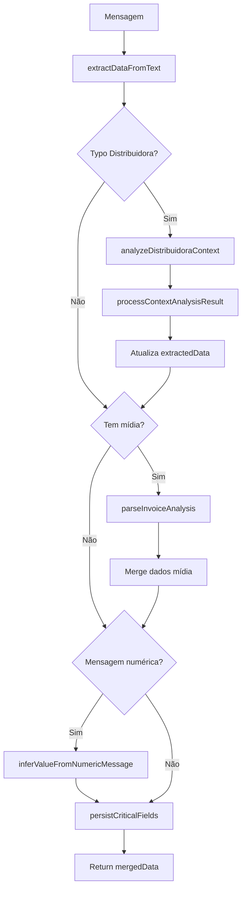

# Módulo: Data Collection Phase

## Propósito

Extrai dados estruturados das mensagens do cliente (nome, email, CPF, CNPJ, valor da fatura, distribuidora) usando uma FSM (Máquina de Estados Finita) e persiste campos críticos imediatamente no banco.

## Fase no Pipeline

- **Número da Fase:** 3
- **Tipo:** Determinístico
- **Layer:** Intake
- **Prioridade:** Média

## Interface

### Context (Entrada)

| Campo | Tipo | Obrigatório | Descrição |
|-------|------|-------------|-----------|
| `supabase` | `SupabaseClient` | ✅ | Cliente Supabase |
| `conversaId` | `string` | ✅ | ID da conversa |
| `phone` | `string` | ✅ | Telefone do cliente |
| `clienteNome` | `string \| null` | ❌ | Nome do cliente |
| `messageText` | `string` | ✅ | Texto da mensagem |
| `messageId` | `string \| null` | ❌ | ID da mensagem |
| `agentId` | `string` | ✅ | ID do agente |
| `conversa` | `DataCollectionConversaData \| null` | ❌ | Dados da conversa |
| `existingDados` | `ExtractedClientData` | ✅ | Dados já coletados |
| `mediaAnalysisResult` | `MediaAnalysisResult?` | ❌ | Resultado de análise de mídia |
| `isAnalyzedImage` | `boolean` | ✅ | Se é imagem analisada |
| `isAnalyzedDocument` | `boolean` | ✅ | Se é documento analisado |
| `isTranscribedAudio` | `boolean` | ✅ | Se é áudio transcrito |
| `lovableApiKey` | `string?` | ❌ | API key para análise contextual |
| `sendWhatsAppMessage` | `function` | ✅ | Função para enviar mensagem |
| `validarDistribuidora` | `function` | ✅ | Função de validação |

### Result (Saída)

| Campo | Tipo | Descrição |
|-------|------|-----------|
| `handled` | `boolean` | Sempre `false` (nunca retorna early) |
| `extractedData` | `ExtractedClientData` | Dados extraídos desta mensagem |
| `mergedData` | `ExtractedClientData` | Dados mesclados com existentes |
| `persistenceResult` | `CriticalPersistenceResult` | Resultado da persistência |

## Dados Extraídos

| Campo | Padrão de Detecção | Exemplo |
|-------|-------------------|---------|
| `nome` | Nome próprio no início | "João da Silva" |
| `email` | Regex de email | "joao@email.com" |
| `cpf` | 11 dígitos formatados | "123.456.789-00" |
| `cnpj` | 14 dígitos formatados | "12.345.678/0001-00" |
| `valorFatura` | Número + R$ ou contexto | "R$ 350" ou "350 reais" |
| `distribuidora` | Match com lista conhecida | "CEMIG", "ENEL" |
| `consumo` | kWh ou consumo mensal | "500 kwh" |
| `tipoInstalacao` | Residencial/comercial | "residencial" |

## Fluxo Interno



## Dependências

| Módulo | Descrição |
|--------|-----------|
| `data-extraction.ts` | Extração de dados do texto |
| `data-persistence.ts` | Persistência de campos críticos |
| `distribuidora-handler.ts` | Validação de distribuidoras |
| `typo-confirmation.ts` | Confirmação de typos |

## Padrões de Extração

### Email
```regex
/[a-zA-Z0-9._%+-]+@[a-zA-Z0-9.-]+\.[a-zA-Z]{2,}/
```

### CPF
```regex
/\d{3}\.?\d{3}\.?\d{3}-?\d{2}/
```

### Valor da Fatura
```regex
/R?\$?\s*(\d{1,3}(?:[.,]\d{3})*(?:[.,]\d{2})?)/
```

### Distribuidora
- Match exato com lista normalizada
- Análise contextual para typos ("cemg" → "CEMIG")

## Exemplos de Uso

### Extração Básica

```typescript
const result = await executeDataCollectionPhase({
  supabase,
  conversaId: '...',
  messageText: 'Meu nome é João, email joao@email.com e pago R$ 350 de luz',
  existingDados: {},
  // ...
});

// result.extractedData = {
//   nome: 'João',
//   email: 'joao@email.com',
//   valorFatura: 350
// }
```

### Inferência de Valor

```typescript
// Contexto: Sofia perguntou o valor da conta
// Cliente responde apenas: "350"

const result = await executeDataCollectionPhase({
  messageText: '350',
  existingDados: { nome: 'João', email: 'joao@email.com' },
  // ...
});

// result.extractedData.valorFatura = 350 (inferido do contexto FSM)
```

### Com Análise de Imagem (Fatura)

```typescript
const result = await executeDataCollectionPhase({
  messageText: '[Imagem analisada]: valor R$ 450, distribuidora CEMIG',
  mediaAnalysisResult: {
    analysis: 'Fatura de energia: R$ 450, CEMIG, consumo 380 kWh',
    isInvoice: true,
  },
  // ...
});

// result.extractedData = {
//   valorFatura: 450,
//   distribuidora: 'CEMIG',
//   consumo: 380
// }
```

## Persistência Crítica

Campos são salvos imediatamente para evitar perda de dados:

```typescript
await persistCriticalFields({
  supabase,
  conversaId,
  existingDados,
  extractedData,
  clienteNome,
  conversa,
});
```

## Métricas

- **Log prefix:** `[DATA_COLLECTION_PHASE]`
- **Métricas importantes:**
  - Taxa de extração por campo
  - Precisão de inferência de valor
  - Typos de distribuidora detectados

## Histórico de Mudanças

| Data | Versão | Descrição |
|------|--------|-----------|
| 2024-01-25 | 1.0 | Extração do sofia-webhook |
| 2024-02-15 | 1.1 | Análise contextual de distribuidora |
| 2024-03-10 | 1.2 | Inferência de valor numérico |

---

**Autor:** Sofia Team  
**Última atualização:** 2026-02-03
