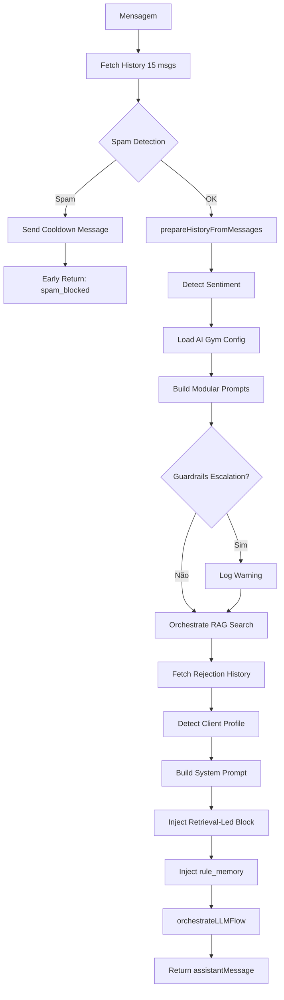

# Módulo: LLM Phase

## Propósito

Orquestra a geração de resposta via LLM: busca histórico, detecta spam, executa RAG, monta prompts modulares, detecta perfil do cliente e chama o modelo de linguagem.

## Fase no Pipeline

- **Número da Fase:** 4
- **Tipo:** LLM-Based
- **Layer:** Reasoning
- **Prioridade:** Alta

## Interface

### Context (Entrada)

| Campo | Tipo | Obrigatório | Descrição |
|-------|------|-------------|-----------|
| `supabase` | `SupabaseClient` | ✅ | Cliente Supabase |
| `conversaId` | `string` | ✅ | ID da conversa |
| `phone` | `string` | ✅ | Telefone do cliente |
| `clienteNome` | `string \| null` | ❌ | Nome do cliente |
| `messageText` | `string` | ✅ | Texto original |
| `effectiveMessageText` | `string` | ✅ | Texto efetivo (pós-buffer) |
| `messageId` | `string \| null` | ❌ | ID da mensagem |
| `agentId` | `string` | ✅ | ID do agente |
| `conversa` | `LLMPhaseConversaData \| null` | ❌ | Dados da conversa |
| `existingDados` | `ExtractedClientData` | ✅ | Dados existentes |
| `extractedData` | `ExtractedClientData` | ✅ | Dados extraídos |
| `propostaInfo` | `PropostaInfo \| null` | ❌ | Info da proposta |
| `finalMode` | `string` | ✅ | Modo Sofia (standard, closer, etc.) |
| `funnelStage` | `string \| null` | ❌ | Estágio do funil |
| `abVariant` | `'A' \| 'B'` | ✅ | Variante A/B |
| `isTranscribedAudio` | `boolean` | ✅ | Se é áudio transcrito |
| `isAnalyzedImage` | `boolean` | ✅ | Se é imagem analisada |
| `isAnalyzedDocument` | `boolean` | ✅ | Se é documento analisado |
| `detectedObjection` | `ObjectionType \| null` | ❌ | Objeção detectada |
| `hesitationDetected` | `boolean` | ✅ | Se hesitação detectada |
| `hesitationResult` | `HesitationFlowResult \| null` | ❌ | Resultado de hesitação |
| `docsSubmittedViaPage` | `boolean` | ✅ | Se docs via página |
| `detectionPatterns` | `Map<string, PatternEntry>` | ✅ | Padrões de detecção |
| `lovableApiKey` | `string` | ✅ | API key para LLM |
| `sendWhatsAppMessage` | `function` | ✅ | Função para enviar mensagem |

### Result (Saída)

| Campo | Tipo | Descrição |
|-------|------|-----------|
| `handled` | `boolean` | Se bloqueou (spam) |
| `response` | `Response?` | HTTP response |
| `assistantMessage` | `string \| null` | Resposta gerada |
| `usedModel` | `string \| null` | Modelo utilizado |
| `systemPrompt` | `string` | Prompt de sistema montado |
| `agentConfig` | `FullAgentConfig` | Config do agente carregada |
| `history` | `ConversationMessage[]` | Histórico sanitizado |
| `spamBlocked` | `boolean` | Se foi bloqueado por spam |
| `ragUsed` | `boolean` | Se RAG foi utilizado |
| `ragCategories` | `string[]` | Categorias RAG usadas |
| `lastAssistantMsg` | `string \| null` | Última mensagem da Sofia |
| `clientProfileResult` | `ClientProfileResult \| null` | Perfil do cliente |
| `rejectionHistory` | `RejectionHistory \| null` | Histórico de rejeição |
| `detectedSentiment` | `string \| null` | Sentimento detectado |
| `ragContextForPrompt` | `RAGPromptContext \| null` | Contexto RAG |

## Fluxo Interno



## Retrieval-Led Reasoning (v2.0)

O sistema prompt inclui uma instrução hierárquica que força a LLM a:

1. **PASSO 1: Consultar rule_memory** (Prioridade Máxima)
   - Regras com prioridade > 90 são bloqueantes
   - Guardrails sobrescrevem qualquer lógica

2. **PASSO 2: Consultar RAG Knowledge**
   - Usar documentos injetados literalmente

3. **PASSO 3: Consultar Dados do Cliente**
   - Apenas dados confirmados no contexto

4. **PASSO 4: Fallback**
   - Perguntar ao cliente ou escalar

## Dependências

| Módulo | Descrição |
|--------|-----------|
| `history-sanitizer.ts` | Sanitização do histórico |
| `greeting-handler.ts` | Detecção de spam |
| `ai-gym-config.ts` | Configuração do AI Gym |
| `prompt-modules.ts` | Prompts modulares |
| `rag-search-client.ts` | Busca RAG |
| `system-prompt-builder.ts` | Construção do prompt |
| `prompt-context-injector.ts` | Injeção de contexto |
| `rejection-fallback.ts` | Histórico de rejeição |
| `continuous-improvement.ts` | Perfil comportamental |
| `llm-client.ts` | Cliente LLM |

## Detecção de Spam

Detecta mensagens repetitivas em curto período:

```typescript
const spamResult = detectSpamPattern({
  conversaId,
  recentAssistantMessages,
  messageSpamThreshold: 5,
  timeWindowSeconds: 60,
});
```

## Perfis de Cliente

| Perfil | Características |
|--------|----------------|
| `technical` | Perguntas técnicas, jargão do setor |
| `simple` | Mensagens curtas, linguagem simples |
| `skeptical` | Objeções frequentes, dúvidas |
| `elderly` | Paciência, explicações detalhadas |
| `objective` | Direto ao ponto, sem rodeios |

## RAG (Retrieval-Augmented Generation)

```typescript
const ragResult = await orchestrateRAGSearch({
  supabase,
  agentId,
  messageText,
  conversaId,
  detectionPatterns,
});
```

Categorias RAG:
- `faq_geral`
- `energia_solar`
- `financeiro`
- `processo`
- `objecoes`

## Exemplos de Uso

### Fluxo Normal

```typescript
const result = await executeLLMPhase({
  supabase,
  conversaId: '...',
  messageText: 'Como funciona a energia solar?',
  // ...
});

// result.assistantMessage = 'A energia solar funciona...'
// result.ragUsed = true
// result.ragCategories = ['energia_solar']
```

### Bloqueio por Spam

```typescript
// Cliente enviou 6 mensagens iguais em 30 segundos
const result = await executeLLMPhase({
  messageText: 'oi',
  // ...
});

// result.handled = true
// result.spamBlocked = true
// Mensagem de cooldown enviada automaticamente
```

## Métricas

- **Log prefix:** `[LLM_PHASE]`
- **Métricas importantes:**
  - Taxa de uso RAG
  - Tempo de resposta LLM
  - Taxa de spam bloqueado
  - Perfis de cliente detectados

## Histórico de Mudanças

| Data | Versão | Descrição |
|------|--------|-----------|
| 2024-02-01 | 1.0 | Extração do sofia-webhook |
| 2024-02-20 | 1.1 | Adicionado client profile detection |
| 2024-03-15 | 1.2 | RAG orchestration melhorado |

---

**Autor:** Sofia Team  
**Última atualização:** 2026-02-03
