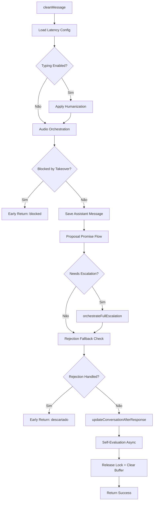

# Módulo: Response Phase

## Propósito

Orquestra a entrega final da resposta ao cliente: aplica delays humanizados, decide entre texto e áudio, detecta promessas de proposta, gerencia escalação para humanos, trata rejeições e atualiza métricas pós-resposta.

## Fase no Pipeline

- **Número da Fase:** 5
- **Tipo:** Híbrido (Determinístico + Áudio TTS)
- **Layer:** Response
- **Prioridade:** Alta

## Interface

### Context (Entrada)

| Campo | Tipo | Obrigatório | Descrição |
|-------|------|-------------|-----------|
| `supabase` | `SupabaseClient` | ✅ | Cliente Supabase |
| `conversaId` | `string` | ✅ | ID da conversa |
| `phone` | `string` | ✅ | Telefone do cliente |
| `clienteNome` | `string \| null` | ❌ | Nome do cliente |
| `messageText` | `string` | ✅ | Texto original |
| `effectiveMessageText` | `string` | ✅ | Texto efetivo |
| `agentId` | `string` | ✅ | ID do agente |
| `cleanMessage` | `string` | ✅ | Mensagem limpa para envio |
| `assistantMessage` | `string \| null` | ❌ | Resposta do LLM |
| `usedModel` | `string \| null` | ❌ | Modelo usado |
| `agentConfig` | `FullAgentConfig \| null` | ❌ | Config do agente |
| `conversa` | `ResponsePhaseConversaData \| null` | ❌ | Dados da conversa |
| `existingDados` | `Record<string, unknown>` | ✅ | Dados existentes |
| `extractedData` | `Record<string, unknown>` | ✅ | Dados extraídos |
| `needsHumanEscalation` | `boolean` | ✅ | Se precisa escalação |
| `aiFailedCompletely` | `boolean` | ✅ | Se AI falhou |
| `isTranscribedAudio` | `boolean` | ✅ | Se é áudio transcrito |
| `newScore` | `number` | ✅ | Novo score do lead |
| `finalMode` | `string` | ✅ | Modo Sofia |
| `totalMessages` | `number` | ✅ | Total de mensagens |
| `detectedObjection` | `string \| null` | ❌ | Objeção detectada |
| `nextFollowupAt` | `string \| Date \| null` | ❌ | Próximo followup |
| `funnelStage` | `string \| null` | ❌ | Estágio do funil |
| `detectedSentiment` | `string \| null` | ❌ | Sentimento detectado |
| `audioSettings` | `SofiaAudioSettings` | ✅ | Config de áudio |
| `clienteAceitaAudio` | `boolean \| null` | ❌ | Se cliente aceita áudio |
| `audioPreferenceJustSet` | `boolean` | ✅ | Se preferência recém-setada |
| `handleDirectAudioRequest` | `boolean` | ✅ | Se pediu áudio diretamente |
| `bufferId` | `string \| null` | ❌ | ID do buffer |
| `messageFns` | `MessageFunctions` | ✅ | Funções de envio |
| `syncFns` | `SyncFunctions` | ✅ | Funções de sync |
| `isAudioGloballyEnabled` | `function` | ✅ | Check áudio global |
| `evaluateResponseLegacy` | `function` | ✅ | Auto-avaliação |

### Result (Saída)

| Campo | Tipo | Descrição |
|-------|------|-----------|
| `handled` | `boolean` | Se retornou early |
| `response` | `Response?` | HTTP response |
| `success` | `boolean` | Se envio foi bem-sucedido |
| `blockedByTakeover` | `boolean` | Se bloqueado por #ASSUMIR |
| `rejectionHandled` | `boolean` | Se rejeição foi tratada |
| `rejectionType` | `RejectionType?` | Tipo de rejeição |
| `audioSent` | `boolean` | Se áudio foi enviado |
| `audioOffered` | `boolean` | Se áudio foi oferecido |
| `finalMessage` | `string` | Mensagem final enviada |

## Fluxo Interno



## Dependências

| Módulo | Descrição |
|--------|-----------|
| `humanized-latency.ts` | Delays humanizados |
| `audio-handler.ts` | Orquestração de áudio |
| `proposal-promise-flow.ts` | Detecção de promessa de proposta |
| `escalation.ts` | Escalação para humanos |
| `rejection-fallback.ts` | Tratamento de rejeição |
| `conversation-update.ts` | Atualização pós-resposta |
| `message-buffer.ts` | Limpeza do buffer |

## Humanização

Aplica delay baseado no tamanho da resposta:

```typescript
await applyFullHumanization({
  responseText: cleanMessage,
  sendTypingIndicator: async () => {
    await messageFns.sendTypingIndicator(phone, agentConfig);
  },
  config: latencyConfig,
});
```

## Orquestração de Áudio

Decide automaticamente entre texto e áudio:

| Condição | Resultado |
|----------|-----------|
| Cliente aceita áudio + resposta > 300 chars | Envia áudio |
| Cliente pediu áudio diretamente | Envia áudio |
| Primeira interação + áudio habilitado | Oferece áudio |
| Áudio globalmente desabilitado | Apenas texto |

## Escalação

```typescript
if (needsHumanEscalation) {
  await orchestrateFullEscalation({
    supabase,
    conversaId,
    phone,
    clienteNome,
    messageText,
    dadosColetados,
    newScore,
    totalMessages,
    agentConfig,
    sendMessage,
  });
}
```

## Rejection Types

| Tipo | Descrição |
|------|-----------|
| `distributor_not_attended` | Distribuidora não atendida |
| `low_value` | Valor da conta muito baixo |
| `rural_area` | Área rural sem CIP |
| `already_has_solar` | Já possui energia solar |
| `commercial_high_voltage` | Comercial alta tensão |

## Exemplos de Uso

### Resposta com Áudio

```typescript
const result = await executeResponsePhase({
  cleanMessage: 'Olá João! Sua proposta ficou pronta...',
  audioSettings: { enabled: true, minCharacters: 200 },
  clienteAceitaAudio: true,
  // ...
});

// result.audioSent = true
// result.finalMessage = '...[🎧 Áudio também enviado]'
```

### Bloqueio por Takeover

```typescript
// Durante processamento, operador digitou #ASSUMIR
const result = await executeResponsePhase({
  // ...
});

// result.blockedByTakeover = true
// Mensagem NÃO foi enviada
```

## Métricas

- **Log prefix:** `[RESPONSE_PHASE]`
- **Métricas importantes:**
  - Taxa de áudio enviado
  - Taxa de escalação
  - Taxa de rejeição por tipo
  - Tempo de resposta total

## Histórico de Mudanças

| Data | Versão | Descrição |
|------|--------|-----------|
| 2024-02-05 | 1.0 | Extração do sofia-webhook |
| 2024-02-25 | 1.1 | Audio orchestration melhorado |
| 2024-03-20 | 1.2 | Rejection fallback expandido |

---

**Autor:** Sofia Team  
**Última atualização:** 2026-02-03
