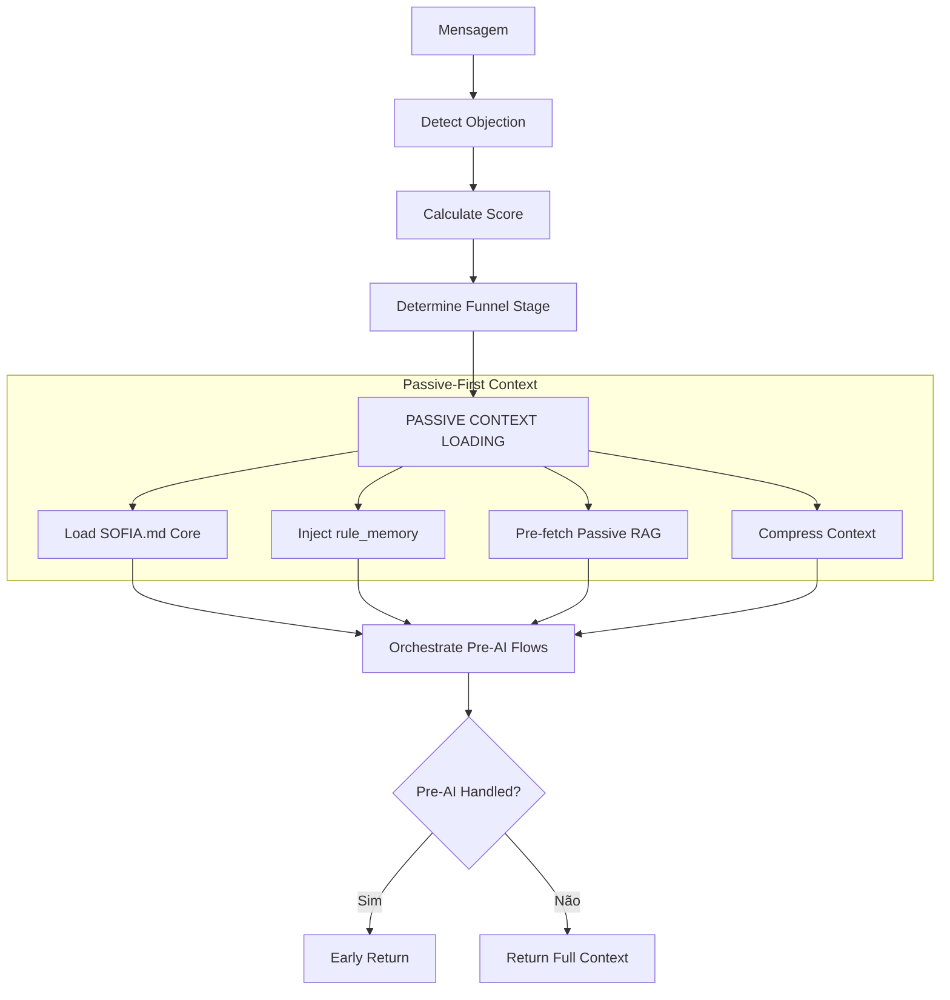

# Módulo: Context Building Phase

## Propósito

Constrói o contexto completo para a geração de resposta usando arquitetura **Passive-First** (AGENTS.md-Style): carrega SOFIA.md, injeta rule_memory, pré-carrega RAG passivo, comprime contexto e executa fluxos pré-AI.

## Fase no Pipeline

- **Número da Fase:** 6
- **Tipo:** Determinístico + Passive Context
- **Layer:** Context
- **Prioridade:** Alta

## Arquitetura Passive-First



## Interface

### Context (Entrada)

| Campo | Tipo | Obrigatório | Descrição |
|-------|------|-------------|-----------|
| `supabase` | `SupabaseClient` | ✅ | Cliente Supabase |
| `conversaId` | `string` | ✅ | ID da conversa |
| `phone` | `string` | ✅ | Telefone do cliente |
| `clienteNome` | `string \| null` | ❌ | Nome do cliente |
| `messageText` | `string` | ✅ | Texto original |
| `effectiveMessageText` | `string` | ✅ | Texto efetivo |
| `agentId` | `string` | ✅ | ID do agente |
| `agentName` | `string` | ✅ | Nome do agente |
| `conversa` | `ContextBuildingConversaData \| null` | ❌ | Dados da conversa |
| `existingDados` | `ExtractedClientData` | ✅ | Dados existentes |
| `extractedData` | `ExtractedClientData` | ✅ | Dados extraídos |
| `detectionPatterns` | `Map<string, PatternEntry>` | ✅ | Padrões de detecção |
| `lovableApiKey` | `string` | ✅ | API key |

### Result (Saída)

| Campo | Tipo | Descrição |
|-------|------|-----------|
| `handled` | `boolean` | Se retornou early |
| `response` | `Response?` | HTTP response |
| `status` | `string?` | Status do fluxo |
| `funnelStage` | `FunnelStage \| null` | Estágio do funil |
| `finalMode` | `SofiaMode` | Modo final |
| `currentScore` | `number` | Score atual |
| `newScore` | `number` | Novo score |
| `passiveRAGResult` | `PassiveRAGResult \| null` | **NOVO** RAG pré-carregado |
| `injectedRules` | `InjectedRulesBlock \| null` | **NOVO** Regras injetadas |
| `hesitationDetected` | `boolean` | Se hesitação detectada |

## Passive Context Loading

### 1. SOFIA.md Core
```typescript
import { loadFullSOFIA, loadSOFIASection } from '../sofia-core-loader.ts';

// Carrega constituição completa (cacheia automaticamente)
const sofiaCore = loadFullSOFIA();

// Ou seções específicas
const identity = loadSOFIASection('identity');
const petreas = loadSOFIASection('petreas');
```

### 2. Rule Memory Injection
```typescript
import { buildRuleMemoryBlock } from '../rule-memory-injector.ts';

const rulesBlock = await buildRuleMemoryBlock(
  supabase,
  agentId,
  { funnelStage, messageText, clientData }
);
// rulesBlock.content = "## REGRAS ATIVAS\n1. [guardrail|P95] ..."
```

### 3. Passive RAG Pre-fetch
```typescript
import { prefetchPassiveRAG } from '../passive-rag-prefetch.ts';

const passiveRAG = await prefetchPassiveRAG(
  supabase,
  agentId,
  funnelStage,
  { maxChunksPerCategory: 3, compressionEnabled: true }
);
// passiveRAG.content = "## CONHECIMENTO PRÉ-CARREGADO\n..."
```

### 4. Context Compression
```typescript
import { compressContext } from '../context-compressor.ts';

const compressed = compressContext(fullPrompt, {
  maxChars: 6000,
  preserveSections: ['CLÁUSULAS PÉTREAS', 'RETRIEVAL-LED'],
  aggressiveness: 'medium'
});
```

## Estágios do Funil → Categorias RAG

| Estágio | Categorias Pré-carregadas |
|---------|---------------------------|
| `triagem` | faq_geral, processo |
| `qualificacao` | energia_solar, faq_geral |
| `coleta_dados` | processo, financeiro |
| `proposta_inicial` | financeiro, objecoes |
| `docs_plataforma` | processo, documentos |
| `proposta_definitiva` | contrato, financeiro |
| `assinatura` | contrato, objecoes |

## Cálculo de Score

Fatores que aumentam score:
- Forneceu email: +10
- Forneceu valor da conta: +15
- Enviou fatura: +20
- Expressou interesse: +10
- Pergunta técnica: +5

## Modos Sofia

| Modo | Descrição |
|------|-----------|
| `standard` | Modo padrão de coleta |
| `closer` | Modo agressivo de fechamento |
| `educator` | Modo educativo para dúvidas |
| `objection_handler` | Tratando objeções |
| `paused_for_human` | Pausado para humano |

## Exemplo de Uso

```typescript
const result = await executeContextBuildingPhase({
  supabase,
  conversaId: '...',
  messageText: 'Minha conta é de R$ 350',
  existingDados: { nome: 'João' },
  extractedData: { valorFatura: 350 },
  // ...
});

// result.newScore = 35
// result.funnelStage = 'coleta_dados'
// result.passiveRAGResult = { content: '...', chunksUsed: 5 }
// result.injectedRules = { content: '...', rulesCount: 3 }
```

## Métricas

- **Log prefix:** `[CONTEXT_BUILDING_PHASE]`
- **Métricas importantes:**
  - Tempo de carregamento Passive Context
  - Número de regras injetadas
  - Chunks RAG pré-carregados
  - Taxa de compressão alcançada

## Feature Flags

```typescript
const ENABLE_PASSIVE_RAG_PREFETCH = true;  // Pre-fetch por estágio
const ENABLE_RULE_MEMORY_INJECTION = true; // Injetar regras
const ENABLE_CONTEXT_COMPRESSION = true;   // Comprimir contexto
```

## Histórico de Mudanças

| Data | Versão | Descrição |
|------|--------|-----------|
| 2024-02-10 | 1.0 | Extração do sofia-webhook |
| 2024-03-01 | 1.1 | Hesitation flow melhorado |
| 2024-03-25 | 1.2 | Pre-AI flows consolidados |
| 2026-02-03 | 2.0 | **Passive-First Architecture** |

---

**Autor:** Sofia Team  
**Última atualização:** 2026-02-03
