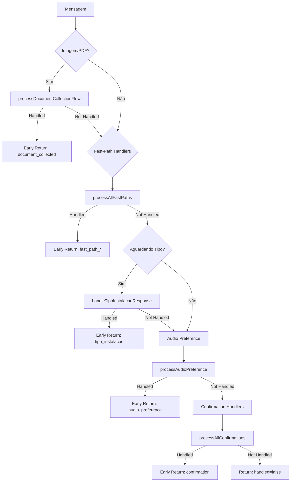
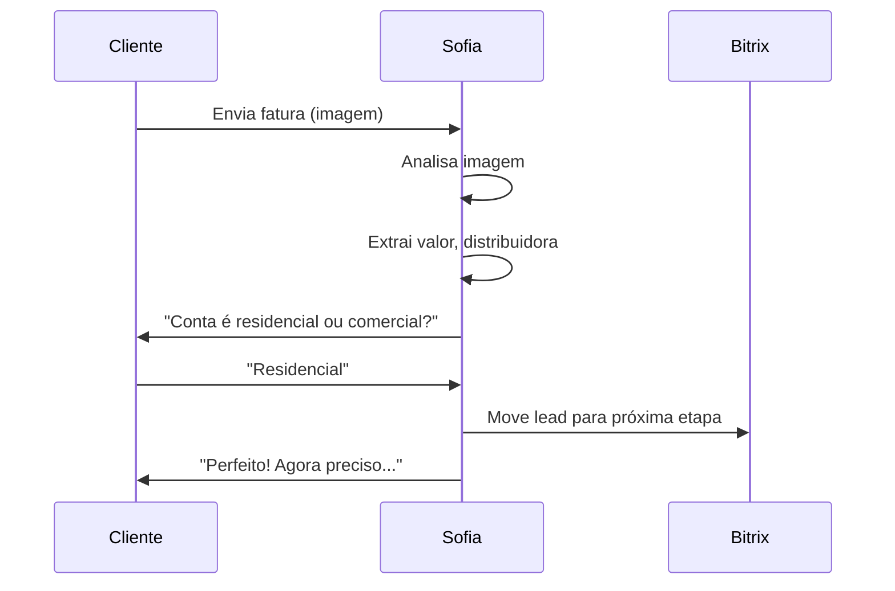

# Módulo: Fast-Path Phase

## Propósito

Processa respostas determinísticas rápidas que não requerem LLM: coleta de documentos, confirmações, preferências de áudio e handlers especializados para padrões conhecidos.

## Fase no Pipeline

- **Número da Fase:** 7
- **Tipo:** Determinístico
- **Layer:** Fast-Paths
- **Prioridade:** Média

## Interface

### Context (Entrada)

| Campo | Tipo | Obrigatório | Descrição |
|-------|------|-------------|-----------|
| `supabase` | `SupabaseClient` | ✅ | Cliente Supabase |
| `conversaId` | `string` | ✅ | ID da conversa |
| `phone` | `string` | ✅ | Telefone do cliente |
| `clienteNome` | `string \| null` | ❌ | Nome do cliente |
| `messageText` | `string` | ✅ | Texto da mensagem |
| `agentId` | `string` | ✅ | ID do agente |
| `conversa` | `FastPathConversaData \| null` | ❌ | Dados da conversa |
| `existingDados` | `ExtractedClientData` | ✅ | Dados existentes |
| `extractedData` | `ExtractedClientData` | ✅ | Dados extraídos |
| `isTranscribedAudio` | `boolean` | ✅ | Se é áudio transcrito |
| `isAnalyzedImage` | `boolean` | ✅ | Se é imagem analisada |
| `isAnalyzedDocument` | `boolean` | ✅ | Se é documento analisado |
| `mediaAnalysisResult` | `MediaAnalysisData \| null` | ❌ | Resultado de análise |
| `totalMessages` | `number` | ✅ | Total de mensagens |
| `crmContext` | `CRMLeadContext?` | ❌ | Contexto CRM |
| `agentConfig` | `FullAgentConfig \| null` | ❌ | Config do agente |
| `detectionPatterns` | `Map<string, PatternEntry>` | ✅ | Padrões |
| `sendWhatsAppMessage` | `function` | ✅ | Função de envio |
| `sendVoiceMessage` | `function` | ✅ | Função de áudio |

### Result (Saída)

| Campo | Tipo | Descrição |
|-------|------|-----------|
| `handled` | `boolean` | Se fast-path resolveu |
| `response` | `Response?` | HTTP response |
| `status` | `string?` | Status do handler |
| `extractedData` | `ExtractedClientData` | Dados atualizados |
| `audioSettings` | `SofiaAudioSettings` | Configurações de áudio |
| `clienteAceitaAudio` | `boolean \| null` | Preferência de áudio |
| `audioPreferenceJustSet` | `boolean` | Se preferência recém-setada |
| `handleDirectAudioRequest` | `boolean` | Se pediu áudio diretamente |

## Fast-Path Handlers

| Handler | Trigger | Ação |
|---------|---------|------|
| Document Collection | Imagem/PDF de fatura | Extrai dados, pede tipo instalação |
| Tipo Instalação | Resposta "residencial"/"comercial" | Avança lead no Bitrix |
| Audio Preference | "prefiro texto" / "pode mandar áudio" | Salva preferência |
| Confirmation | "sim", "pode ser", "aceito" | Confirma ação pendente |
| Greeting Response | Primeira mensagem genérica | Saudação contextual |

## Fluxo Interno



## Dependências

| Módulo | Descrição |
|--------|-----------|
| `fast-path-handlers.ts` | Handlers principais |
| `document-collection-flow.ts` | Fluxo de documentos |
| `confirmation-handlers.ts` | Handlers de confirmação |
| `audio-handler.ts` | Preferência de áudio |

## Document Collection Flow

### Documentos Aceitos

| Tipo | Descrição |
|------|-----------|
| `conta_luz` | Fatura de energia |
| `rg_frente` | RG frente |
| `rg_verso` | RG verso |
| `cnh` | CNH |
| `comprovante_endereco` | Comprovante de residência |
| `contrato_social` | Contrato social (PJ) |

### Fluxo de Coleta



## Audio Preference

### Padrões de Detecção

```typescript
// Prefere texto
/prefir[oa]\s*texto/i
/n[aã]o.*\b[aá]udio/i
/s[oó]\s*texto/i

// Aceita áudio
/pode\s*(mandar|enviar)\s*[aá]udio/i
/gosto\s*de\s*[aá]udio/i
/[aá]udio\s*(é|está)\s*(bom|ótimo)/i
```

## Exemplos de Uso

### Coleta de Documento

```typescript
const result = await executeFastPathPhase({
  isAnalyzedImage: true,
  mediaAnalysisResult: {
    analysis: 'Fatura CEMIG, R$ 450, maio/2024',
    isInvoice: true,
  },
  // ...
});

// result.handled = true
// result.status = 'waiting_tipo_instalacao'
// Pergunta "residencial ou comercial?" já enviada
```

### Preferência de Áudio

```typescript
const result = await executeFastPathPhase({
  messageText: 'Pode mandar áudio sim, prefiro ouvir',
  // ...
});

// result.handled = true (se era primeira vez)
// result.clienteAceitaAudio = true
// result.audioPreferenceJustSet = true
```

## Métricas

- **Log prefix:** `[FAST_PATH_PHASE]`
- **Métricas importantes:**
  - Taxa de resolução por fast-path
  - Documentos coletados por tipo
  - Taxa de preferência áudio

## Histórico de Mudanças

| Data | Versão | Descrição |
|------|--------|-----------|
| 2024-02-15 | 1.0 | Extração do sofia-webhook |
| 2024-03-05 | 1.1 | Document collection flow |
| 2024-03-30 | 1.2 | Audio preference melhorado |

---

**Autor:** Sofia Team  
**Última atualização:** 2026-02-03
