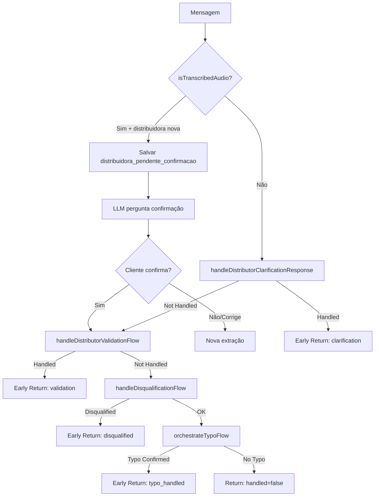
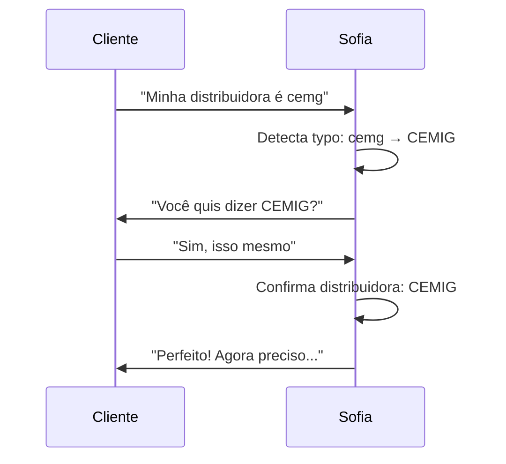

# Módulo: Validation Phase

## Propósito

Valida dados críticos coletados: verifica se a distribuidora é atendida, detecta e confirma typos, e executa fluxos de desqualificação quando necessário.

## Fase no Pipeline

- **Número da Fase:** 8
- **Tipo:** Determinístico
- **Layer:** Fast-Paths
- **Prioridade:** Média

## Interface

### Context (Entrada)

| Campo | Tipo | Obrigatório | Descrição |
|-------|------|-------------|-----------|
| `supabase` | `SupabaseClient` | ✅ | Cliente Supabase |
| `conversaId` | `string` | ✅ | ID da conversa |
| `phone` | `string` | ✅ | Telefone do cliente |
| `clienteNome` | `string \| null` | ❌ | Nome do cliente |
| `messageText` | `string` | ✅ | Texto da mensagem |
| `agentId` | `string` | ✅ | ID do agente |
| `agentName` | `string` | ✅ | Nome do agente |
| `conversa` | `ValidationConversaData \| null` | ❌ | Dados da conversa |
| `existingDados` | `ExtractedClientData` | ✅ | Dados existentes |
| `extractedData` | `ExtractedClientData` | ✅ | Dados extraídos |
| `distribuidoraCache` | `DistribuidoraCache \| null` | ❌ | Cache de distribuidoras |
| `validarDistribuidora` | `function` | ✅ | Função de validação |
| `detectionPatterns` | `Map<string, PatternEntry>` | ✅ | Padrões de detecção |
| `sendWhatsAppMessage` | `function` | ✅ | Função de envio |

### Result (Saída)

| Campo | Tipo | Descrição |
|-------|------|-----------|
| `handled` | `boolean` | Se validação resolveu |
| `response` | `Response?` | HTTP response |
| `status` | `string?` | Status da validação |
| `extractedData` | `ExtractedClientData` | Dados atualizados |
| `distributorValidated` | `boolean` | Se distribuidora validada |
| `distributorRejected` | `boolean` | Se distribuidora rejeitada |
| `typoDetected` | `boolean` | Se typo foi detectado |
| `disqualified` | `boolean` | Se lead desqualificado |
| `disqualificationReason` | `string?` | Motivo desqualificação |

## Fluxos de Validação

### 1. Distributor Clarification
Quando cliente responde a uma pergunta de confirmação de distribuidora.

### 2. Distributor Validation
Valida distribuidora recém-extraída contra lista de atendidas.

### 3. Disqualification
Verifica regras de desqualificação (área rural, já tem solar, etc.).

### 4. Typo Confirmation
Detecta e confirma typos em nomes de distribuidoras.

## Fluxo Interno



## Dependências

| Módulo | Descrição |
|--------|-----------|
| `distribuidora-handler.ts` | Validação de distribuidoras |
| `typo-confirmation.ts` | Fluxo de confirmação de typo |
| `disqualification-flow.ts` | Regras de desqualificação |

## Status de Distribuidora

| Status | Descrição | Ação |
|--------|-----------|------|
| `attended` | Atendida pela Coesa | Continua fluxo |
| `not_attended` | Não atendida | Desqualifica com explicação |
| `unknown` | Não reconhecida | Pergunta ao cliente |
| `typo_detected` | Possível typo | Pede confirmação |

## Regras de Desqualificação

| Regra | Padrão de Detecção | Ação |
|-------|-------------------|------|
| Área Rural | "não tenho CIP", "área rural" | Desqualifica com explicação |
| Já tem Solar | "já tenho energia solar" | Desqualifica |
| Valor Baixo | Fatura < R$ 200 | Desqualifica com valor mínimo |
| Alta Tensão | "A4", "alta tensão" | Redireciona para comercial |

## Typo Detection

### Padrões Comuns

| Typo | Correção |
|------|----------|
| "cemg" | CEMIG |
| "ceimg" | CEMIG |
| "enell" | ENEL |
| "copell" | COPEL |
| "elletropaulo" | ENEL SP |

### Fluxo de Confirmação



## Exemplos de Uso

### Distribuidora Não Atendida

```typescript
const result = await executeValidationPhase({
  messageText: 'Minha distribuidora é COELBA',
  extractedData: { distribuidora: 'COELBA' },
  // ...
});

// result.handled = true
// result.distributorRejected = true
// Mensagem de desqualificação já enviada
```

### Typo Detectado

```typescript
const result = await executeValidationPhase({
  messageText: 'A conta é da cemg',
  extractedData: { distribuidora: 'cemg' },
  // ...
});

// result.handled = true
// result.typoDetected = true
// result.status = 'awaiting_confirmation'
// Pergunta "Você quis dizer CEMIG?" enviada
```

### Desqualificação por Área Rural

```typescript
const result = await executeValidationPhase({
  messageText: 'Moro na roça, não tenho CIP',
  // ...
});

// result.handled = true
// result.disqualified = true
// result.disqualificationReason = 'rural_sem_cip'
```

## Métricas

- **Log prefix:** `[VALIDATION_PHASE]`
- **Métricas importantes:**
  - Taxa de distribuidoras não atendidas
  - Taxa de typos detectados/confirmados
  - Taxa de desqualificação por regra

## Histórico de Mudanças

| Data | Versão | Descrição |
|------|--------|-----------|
| 2024-02-20 | 1.0 | Extração do sofia-webhook |
| 2024-03-10 | 1.1 | Typo confirmation flow |
| 2024-04-01 | 1.2 | Regras de desqualificação expandidas |

---

**Autor:** Sofia Team  
**Última atualização:** 2026-02-03
