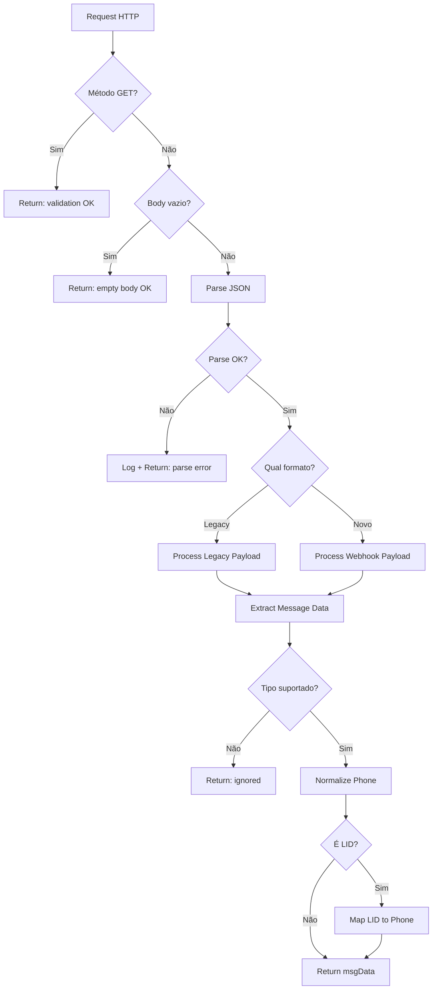

# Módulo: Webhook Initialization Phase

## Propósito

Processa a requisição HTTP inicial do webhook: parsing do body, detecção de formato (legacy vs novo), extração de dados da mensagem, normalização de telefone e logging de eventos.

## Fase no Pipeline

- **Número da Fase:** 9
- **Tipo:** Determinístico
- **Layer:** Initialization
- **Prioridade:** Média

## Interface

### Context (Entrada)

| Campo | Tipo | Obrigatório | Descrição |
|-------|------|-------------|-----------|
| `req` | `Request` | ✅ | Request HTTP |
| `bodyText` | `string` | ✅ | Body como texto |
| `supabase` | `SupabaseClient` | ✅ | Cliente Supabase |

### Result (Saída)

| Campo | Tipo | Descrição |
|-------|------|-----------|
| `handled` | `boolean` | Se retornou early |
| `response` | `Response?` | HTTP response |
| `msgData` | `MessageData?` | Dados da mensagem |
| `phone` | `string?` | Telefone normalizado |
| `clienteNome` | `string \| null?` | Nome do cliente |
| `chatappChatId` | `string?` | ID do chat Z-API |
| `messageId` | `string?` | ID da mensagem |
| `isLegacyFormat` | `boolean?` | Se é formato legacy |
| `webhookPayload` | `WebhookPayload \| null?` | Payload novo |
| `legacyPayload` | `LegacyPayload \| null?` | Payload legacy |
| `agentId` | `string?` | ID do agente |

## Fluxo Interno



## Dependências

| Módulo | Descrição |
|--------|-----------|
| `utils/phone-utils.ts` | Normalização de telefone |
| `webhook-types.ts` | Tipos de payload |
| `zod-schemas.ts` | Validação de schemas |

## Formatos de Payload

### Formato Novo (Z-API v2)

```json
{
  "phone": "5511999999999",
  "event": "message-received",
  "message": {
    "id": "msg_id",
    "text": "Olá",
    "type": "text",
    "fromMe": false
  },
  "contact": {
    "name": "João"
  }
}
```

### Formato Legacy

```json
{
  "instanceId": "instance_id",
  "phone": "5511999999999",
  "text": {
    "message": "Olá"
  },
  "senderName": "João"
}
```

## Tipos de Mensagem Suportados

| Tipo | Processamento |
|------|---------------|
| `text` | Texto direto |
| `audio` | Transcrição |
| `image` | Análise visual |
| `document` | Análise PDF |
| `sticker` | Ignorado |
| `video` | Ignorado |
| `reaction` | Ignorado |

## Normalização de Telefone

```typescript
// Entrada: qualquer formato
'11999999999'
'+55 (11) 99999-9999'
'5511999999999'

// Saída: formato normalizado
'5511999999999'
```

## LID Phone Mapping

Para números com formato LID (identificador interno Z-API):

```typescript
if (isLidPhone(phone)) {
  const mapping = await saveLidPhoneMapping(supabase, lidPhone, realPhone);
  phone = realPhone;
}
```

## Condições de Early Return

| Condição | Response Status | Descrição |
|----------|-----------------|-----------|
| GET request | `ok` | Validação de webhook |
| Body vazio | `ok` | Ping/keep-alive |
| Parse error | `error` | JSON inválido |
| fromMe=true | `ignored` | Mensagem própria |
| Tipo não suportado | `ignored` | Sticker, video, etc. |

## Exemplos de Uso

### Request Válido

```typescript
const result = await executeWebhookInitialization({
  req,
  bodyText: JSON.stringify({
    phone: '5511999999999',
    message: { text: 'Olá' },
    // ...
  }),
  supabase,
});

// result.handled = false
// result.phone = '5511999999999'
// result.msgData = { message: { text: 'Olá' }, ... }
```

### Mensagem Própria (Ignorada)

```typescript
const result = await executeWebhookInitialization({
  bodyText: JSON.stringify({
    message: { fromMe: true, text: 'Resposta Sofia' },
  }),
  // ...
});

// result.handled = true
// result.response.status = 200
// Body: { status: 'ignored', reason: 'own message' }
```

## Logging

Todos os eventos são logados em `whatsapp_webhook_events`:

```typescript
await logWebhookEvent(supabase, {
  request_method: 'POST',
  content_type: 'application/json',
  body_raw: bodyText,
  body_parsed: parsed,
  parsed_ok: true,
  event_type: 'message',
  phone: normalizedPhone,
  message_preview: messageText?.substring(0, 500),
  processing_status: 'processing',
});
```

## Métricas

- **Log prefix:** `[WEBHOOK_INIT]`
- **Métricas importantes:**
  - Taxa de parse errors
  - Distribuição de tipos de mensagem
  - Taxa de mensagens próprias ignoradas

## Histórico de Mudanças

| Data | Versão | Descrição |
|------|--------|-----------|
| 2024-02-25 | 1.0 | Extração do sofia-webhook |
| 2024-03-15 | 1.1 | LID phone mapping |
| 2024-04-05 | 1.2 | Suporte formato v2 |

---

**Autor:** Sofia Team  
**Última atualização:** 2026-02-03
