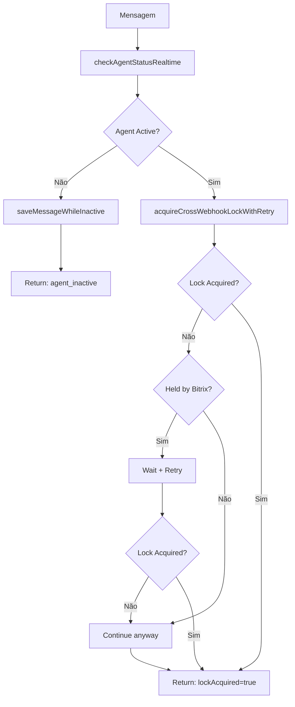

# Módulo: Agent Lock Phase

## Propósito

Verifica status do agente em tempo real (sem cache) e adquire lock distribuído para evitar processamento simultâneo de webhooks concorrentes.

## Fase no Pipeline

- **Número da Fase:** 10
- **Tipo:** Determinístico
- **Layer:** Initialization
- **Prioridade:** Média

## Interface

### Context (Entrada)

| Campo | Tipo | Obrigatório | Descrição |
|-------|------|-------------|-----------|
| `supabase` | `SupabaseClient` | ✅ | Cliente Supabase |
| `phone` | `string` | ✅ | Telefone do cliente |
| `agentId` | `string` | ✅ | ID do agente |
| `messageId` | `string?` | ❌ | ID da mensagem |
| `msgData` | `MessageData?` | ❌ | Dados da mensagem |
| `chatappChatId` | `string?` | ❌ | ID do chat |

### Result (Saída)

| Campo | Tipo | Descrição |
|-------|------|-----------|
| `handled` | `boolean` | Se retornou early |
| `response` | `Response?` | HTTP response |
| `agentStatus` | `string?` | Status do agente |
| `agentName` | `string?` | Nome do agente |
| `lockAcquired` | `boolean?` | Se lock foi adquirido |
| `lockInfo` | `CrossLockInfo?` | Info do lock |

## Fluxo Interno



## Dependências

| Módulo | Descrição |
|--------|-----------|
| `webhook-types.ts` | CORS headers |

## Agent Status

| Status | Descrição | Ação |
|--------|-----------|------|
| `active` | Agente ativo | Continua processamento |
| `paused` | Agente pausado | Salva mensagem, não processa |
| `maintenance` | Em manutenção | Salva mensagem, não processa |
| `unknown` | Não encontrado | Trata como inativo |

## Cross-Webhook Lock

### Propósito
Evita que múltiplas instâncias do webhook processem a mesma mensagem simultaneamente.

### Implementação
```sql
-- RPC function: acquire_cross_webhook_lock
SELECT * FROM acquire_cross_webhook_lock(
  p_phone := '5511999999999',
  p_lead_id := null,
  p_locked_by := 'sofia-webhook',
  p_purpose := 'message_processing',
  p_lock_duration_seconds := 45
);
```

### Lock Info

| Campo | Tipo | Descrição |
|-------|------|-----------|
| `acquired` | `boolean` | Se lock foi obtido |
| `existingLockBy` | `string?` | Quem tem o lock |
| `existingLockPurpose` | `string?` | Propósito do lock |

## Retry Logic

Quando `bitrix24-link-webhook` tem o lock:

```typescript
// Primeira tentativa falhou
if (firstAttempt.existingLockBy === 'bitrix24-link-webhook') {
  // Aguarda 2 segundos
  await new Promise(resolve => setTimeout(resolve, 2000));
  // Tenta novamente
  const retryResult = await acquireCrossWebhookLock(...);
}
```

## Exemplos de Uso

### Agente Ativo

```typescript
const result = await executeAgentLockPhase({
  supabase,
  phone: '5511999999999',
  agentId: 'sofia',
  // ...
});

// result.handled = false
// result.agentStatus = 'active'
// result.lockAcquired = true
```

### Agente Pausado

```typescript
const result = await executeAgentLockPhase({
  supabase,
  phone: '5511999999999',
  agentId: 'sofia',
  msgData: { message: { text: 'Olá' } },
  // ...
});

// result.handled = true
// result.agentStatus = 'paused'
// Mensagem foi salva para histórico
```

### Lock Não Adquirido (Bitrix processando)

```typescript
const result = await executeAgentLockPhase({
  // ...
});

// result.lockAcquired = false
// result.lockInfo.existingLockBy = 'bitrix24-link-webhook'
// Continua processamento mesmo assim (após retry)
```

## Métricas

- **Log prefix:** `[AGENT_STATUS]`, `[CROSS_LOCK]`
- **Métricas importantes:**
  - Taxa de agente inativo
  - Taxa de locks não adquiridos
  - Tempo de espera por retry

## Histórico de Mudanças

| Data | Versão | Descrição |
|------|--------|-----------|
| 2024-03-01 | 1.0 | Extração do sofia-webhook |
| 2024-03-20 | 1.1 | Retry logic para Bitrix |
| 2024-04-10 | 1.2 | saveMessageWhileInactive |

---

**Autor:** Sofia Team  
**Última atualização:** 2026-02-03
