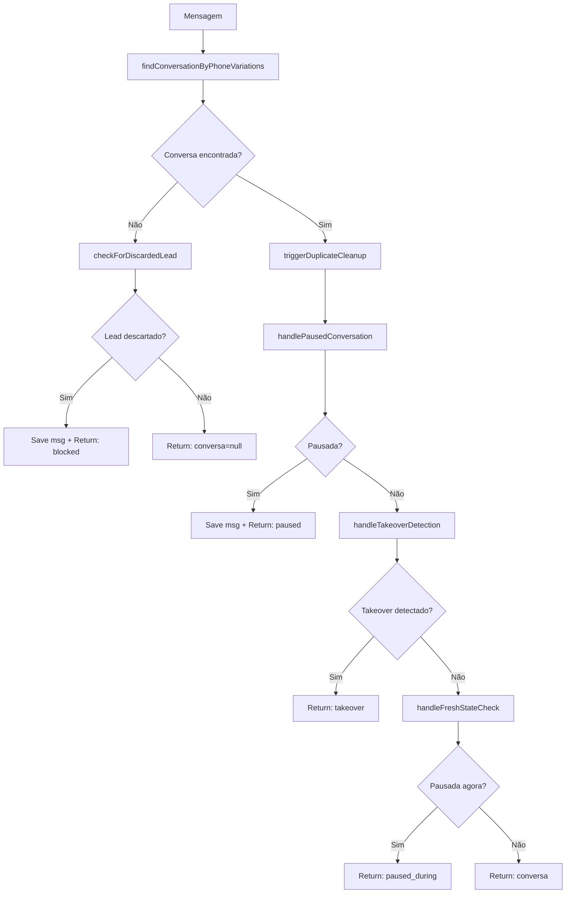

# Módulo: Conversation Lifecycle Phase

## Propósito

Gerencia o ciclo de vida da conversa: busca por telefone com variações, verifica leads descartados, detecta pausas, identifica takeovers e limpa duplicatas.

## Fase no Pipeline

- **Número da Fase:** 11
- **Tipo:** Determinístico
- **Layer:** Hard Stops
- **Prioridade:** Média

## Interface

### Context (Entrada)

| Campo | Tipo | Obrigatório | Descrição |
|-------|------|-------------|-----------|
| `supabase` | `SupabaseClient` | ✅ | Cliente Supabase |
| `phone` | `string` | ✅ | Telefone do cliente |
| `agentId` | `string` | ✅ | ID do agente |
| `clienteNome` | `string \| null?` | ❌ | Nome do cliente |
| `messageText` | `string` | ✅ | Texto da mensagem |
| `messageId` | `string?` | ❌ | ID da mensagem |
| `agentConfig` | `FullAgentConfig \| null?` | ❌ | Config do agente |
| `sendWhatsAppMessage` | `function` | ✅ | Função de envio |
| `templateCache` | `any?` | ❌ | Cache de templates |

### Result (Saída)

| Campo | Tipo | Descrição |
|-------|------|-----------|
| `handled` | `boolean` | Se retornou early |
| `response` | `Response?` | HTTP response |
| `conversa` | `ConversaData \| null?` | Dados da conversa |
| `wasDiscarded` | `boolean?` | Se era lead descartado |
| `wasPaused` | `boolean?` | Se estava pausado |
| `wasTakenOver` | `boolean?` | Se detectou takeover |

## Fluxo Interno



## Dependências

| Módulo | Descrição |
|--------|-----------|
| `utils/phone-utils.ts` | Busca por variações de telefone |
| `operator-commands.ts` | Detecção de takeover |
| `zapi-client.ts` | Credenciais Z-API |

## Phone Variations

Busca conversa por variações do número:

```typescript
// Variações tentadas:
'5511999999999'  // Com código país + DDD
'11999999999'    // Sem código país
'999999999'      // Sem código país nem DDD
```

## Discarded Lead Check

Verifica se telefone pertence a lead recentemente descartado:

```typescript
const discardedCheck = await checkForDiscardedLead(supabase, phone, agentId);

// discardedCheck = {
//   isDiscarded: true,
//   motivoDescarte: 'distributor_not_attended',
//   distribuidora: 'COELBA',
//   discardedAt: '2024-03-01T10:00:00Z',
//   discardedConversaId: 'uuid...'
// }
```

## Pause States

| Estado | Descrição | Ação |
|--------|-----------|------|
| `sofia_mode = 'paused_for_human'` | Pausado por #ASSUMIR | Salva mensagem, bloqueia |
| `needs_human_fallback = true` | Precisa humano | Log warning, continua |

## Takeover Detection

Detecta #ASSUMIR não processado no histórico:

```typescript
const takeoverResult = await detectTakeoverByHistory(supabase, phone, {
  conversaId,
  clienteNome,
  messageText,
  instanceId,
  token,
  sendMessage,
});
```

## Race Condition Protection

Re-verifica estado após processamento inicial:

```typescript
const freshState = await checkFreshConversationState(supabase, conversaId);

if (freshState.isPaused) {
  // Conversa foi pausada DURANTE processamento
  // Bloqueia resposta
}
```

## Duplicate Cleanup

Remove conversas duplicadas em background:

```typescript
cleanupDuplicateConversations(supabase, phone, agentId, activeConversaId)
  .then(result => {
    // result.merged = 5 (mensagens movidas)
    // result.deleted = ['uuid1', 'uuid2'] (conversas fechadas)
  });
```

## Exemplos de Uso

### Conversa Normal

```typescript
const result = await executeConversationLifecyclePhase({
  supabase,
  phone: '5511999999999',
  agentId: 'sofia',
  messageText: 'Olá',
  // ...
});

// result.handled = false
// result.conversa = { id: '...', cliente_nome: 'João', ... }
```

### Lead Descartado

```typescript
const result = await executeConversationLifecyclePhase({
  phone: '5511888888888', // Lead descartado ontem
  // ...
});

// result.handled = true
// result.wasDiscarded = true
// Mensagem foi salva, mas não processada
```

### Conversa Pausada

```typescript
const result = await executeConversationLifecyclePhase({
  phone: '5511777777777', // Operador assumiu com #ASSUMIR
  // ...
});

// result.handled = true
// result.wasPaused = true
// Mensagem salva para o operador ver
```

## Métricas

- **Log prefix:** `[CONVERSATION_LIFECYCLE]`, `[DISCARDED_BLOCK]`
- **Métricas importantes:**
  - Taxa de leads descartados bloqueados
  - Taxa de conversas pausadas
  - Taxa de takeovers detectados

## Histórico de Mudanças

| Data | Versão | Descrição |
|------|--------|-----------|
| 2024-03-05 | 1.0 | Extração do sofia-webhook |
| 2024-03-25 | 1.1 | Takeover detection |
| 2024-04-15 | 1.2 | Fresh state check (race condition) |

---

**Autor:** Sofia Team  
**Última atualização:** 2026-02-03
