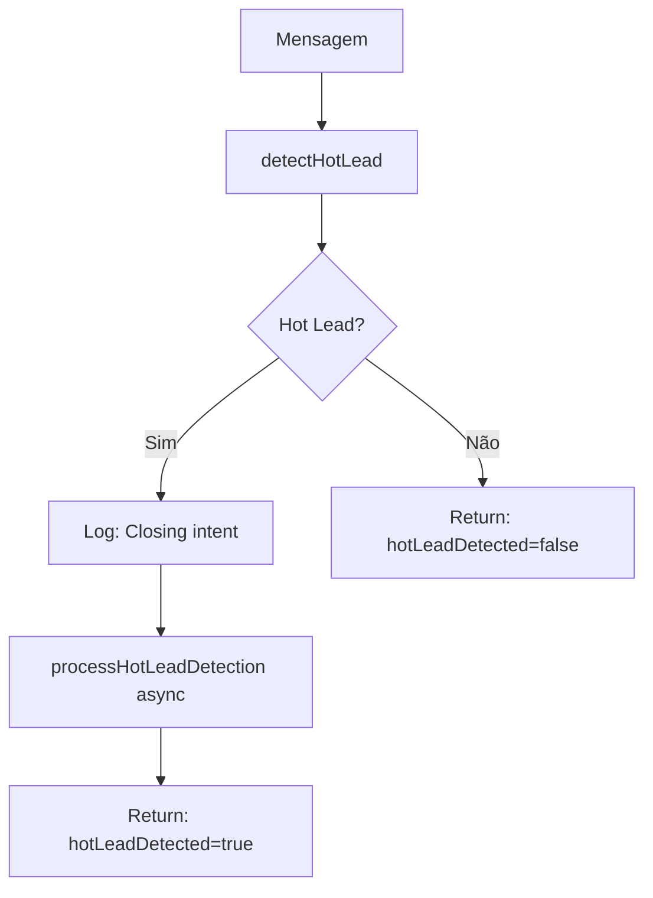

# Módulo: Lead Processing Phase

## Propósito

Processa informações de lead: detecta hot leads (intenção de fechamento), gerencia criação de leads no Bitrix e salva mensagens com contexto de mídia.

## Fase no Pipeline

- **Número da Fase:** 12
- **Tipo:** Determinístico
- **Layer:** Intake
- **Prioridade:** Baixa

## Interface

### Context (Entrada)

| Campo | Tipo | Obrigatório | Descrição |
|-------|------|-------------|-----------|
| `supabase` | `SupabaseClient` | ✅ | Cliente Supabase |
| `conversaId` | `string` | ✅ | ID da conversa |
| `phone` | `string` | ✅ | Telefone do cliente |
| `messageText` | `string` | ✅ | Texto da mensagem |
| `detectionPatterns` | `Map<string, PatternEntry>` | ✅ | Padrões de detecção |
| `conversa` | `LeadProcessingConversaData \| null?` | ❌ | Dados da conversa |
| `dadosColetados` | `Record<string, unknown> \| null?` | ❌ | Dados coletados |

### Result (Saída)

| Campo | Tipo | Descrição |
|-------|------|-----------|
| `hotLeadDetected` | `boolean` | Se hot lead detectado |
| `hotLeadPattern` | `string?` | Padrão que matchou |
| `alertSent` | `boolean?` | Se alerta foi enviado |

## Fluxo Interno



## Dependências

| Módulo | Descrição |
|--------|-----------|
| `hot-lead-detection.ts` | Detecção de hot leads |
| `detection-patterns.ts` | Padrões de detecção |

## Hot Lead Patterns

Padrões que indicam intenção de fechamento:

| Padrão | Exemplo |
|--------|---------|
| Aceitação direta | "Quero fechar", "Vamos fazer" |
| Pergunta de contrato | "Como funciona o contrato?" |
| Disponibilidade | "Quando vocês podem instalar?" |
| Confirmação de dados | "Meus dados estão certos" |
| Urgência | "Preciso urgente", "Quanto antes" |

## Save Message With Context

Salva mensagem com prefixo indicando tipo de mídia:

```typescript
await saveIncomingMessageWithContext(supabase, {
  conversaId: '...',
  messageText: 'Análise da fatura...',
  isTranscribedAudio: false,
  isAnalyzedImage: true,
  isAnalyzedDocument: false,
});

// Salva: "[📷 Imagem analisada]: Análise da fatura..."
```

### Prefixos

| Tipo | Prefixo |
|------|---------|
| Áudio transcrito | `[🎤 Áudio transcrito]: ` |
| Imagem analisada | `[📷 Imagem analisada]: ` |
| PDF analisado | `[📄 PDF analisado]: ` |
| Texto normal | (sem prefixo) |

## Bitrix Lead Creation

Verifica se deve criar lead no Bitrix:

```typescript
const trigger = shouldCreateBitrixLead(
  detectedInvoice,      // true se fatura detectada
  isAnalyzedImage,      // true se imagem
  isAnalyzedDocument,   // true se PDF
  existingLeadId        // null se não existe
);

// trigger = {
//   shouldCreate: true,
//   reason: 'invoice_detected',
//   mediaType: 'image'
// }
```

## Exemplos de Uso

### Hot Lead Detectado

```typescript
const result = await executeLeadProcessingPhase({
  supabase,
  conversaId: '...',
  messageText: 'Quero fechar, quando posso assinar?',
  detectionPatterns,
  // ...
});

// result.hotLeadDetected = true
// result.hotLeadPattern = 'closing_intent'
// Alerta enviado para vendas (async)
```

### Mensagem Normal

```typescript
const result = await executeLeadProcessingPhase({
  messageText: 'Qual o horário de vocês?',
  // ...
});

// result.hotLeadDetected = false
```

### Salvar Mensagem de Áudio

```typescript
await saveIncomingMessageWithContext(supabase, {
  conversaId: '...',
  messageText: 'Cliente disse que quer economizar na conta de luz',
  isTranscribedAudio: true,
});

// Salva: "[🎤 Áudio transcrito]: Cliente disse que quer economizar..."
```

## Métricas

- **Log prefix:** `[HOT_LEAD]`, `[LEAD_PROCESSING]`
- **Métricas importantes:**
  - Taxa de hot leads detectados
  - Padrões mais frequentes
  - Taxa de criação de leads Bitrix

## Histórico de Mudanças

| Data | Versão | Descrição |
|------|--------|-----------|
| 2024-03-10 | 1.0 | Extração do sofia-webhook |
| 2024-04-01 | 1.1 | Hot lead detection melhorado |
| 2024-04-20 | 1.2 | Media context prefixes |

---

**Autor:** Sofia Team  
**Última atualização:** 2026-02-03
