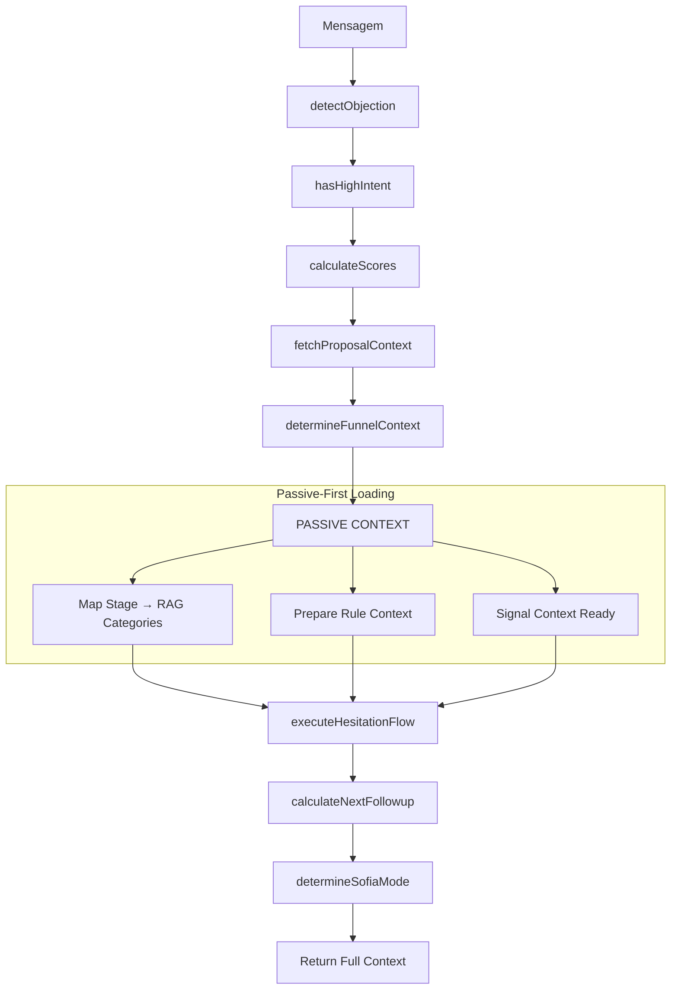

# Módulo: Funnel Context Phase

## Propósito

Calcula o contexto completo do funil de vendas usando arquitetura **Passive-First**: score do lead, estágio atual, modo de operação, detecção de hesitação, com injeção passiva de regras e RAG.

## Fase no Pipeline

- **Número da Fase:** 13
- **Tipo:** Determinístico + Passive Context
- **Layer:** Context
- **Prioridade:** Média

## Interface

### Context (Entrada)

| Campo | Tipo | Obrigatório | Descrição |
|-------|------|-------------|-----------|
| `supabase` | `SupabaseClient` | ✅ | Cliente Supabase |
| `conversaId` | `string` | ✅ | ID da conversa |
| `phone` | `string` | ✅ | Telefone do cliente |
| `clienteNome` | `string \| null?` | ❌ | Nome do cliente |
| `messageText` | `string` | ✅ | Texto da mensagem |
| `agentId` | `string` | ✅ | ID do agente |
| `agentConfig` | `FullAgentConfig \| null?` | ❌ | Config do agente |
| `conversa` | `FunnelContextConversaData \| null?` | ❌ | Dados da conversa |
| `extractedData` | `ExtractedClientData` | ✅ | Dados extraídos |
| `currentScore` | `number` | ✅ | Score atual |
| `currentMode` | `SofiaMode` | ✅ | Modo atual |
| `currentObjection` | `string \| null?` | ❌ | Objeção atual |
| `detectionPatterns` | `Map<string, PatternEntry>` | ✅ | Padrões |

### Result (Saída)

| Campo | Tipo | Descrição |
|-------|------|-----------|
| `funnelStage` | `FunnelStage` | Estágio do funil |
| `sofiaMode` | `SofiaMode` | Modo de operação |
| `newScore` | `number` | Novo score |
| `scoreBreakdown` | `ScoreBreakdown` | Detalhes do score |
| `nextFollowupAt` | `Date \| null` | Próximo followup |
| `propostaInfo` | `ProposalInfo \| null` | Info da proposta |
| `hesitationDetected` | `boolean` | Se hesitação detectada |
| `passiveContextReady` | `boolean` | **NOVO** Contexto passivo pronto |

## Fluxo Interno (Passive-First)



## Funnel Stage → Passive RAG Mapping

```typescript
const STAGE_TO_RAG_CATEGORIES: Record<string, string[]> = {
  'triagem': ['faq_geral', 'processo'],
  'qualificacao': ['energia_solar', 'faq_geral'],
  'coleta_dados': ['processo', 'financeiro'],
  'proposta_inicial_criada': ['financeiro', 'objecoes'],
  'proposta_inicial_enviada': ['objecoes', 'contrato'],
  'docs_plataforma': ['processo', 'documentos'],
  'proposta_definitiva': ['contrato', 'financeiro'],
  'assinatura': ['contrato', 'objecoes'],
  'fechado': ['pos_venda'],
};
```

## Funnel Stages

| Estágio | Condições | RAG Categories |
|---------|-----------|----------------|
| `triagem` | Sem dados básicos | faq_geral, processo |
| `qualificacao` | Tem nome, sem valor | energia_solar, faq_geral |
| `coleta_dados` | Coletando dados críticos | processo, financeiro |
| `proposta_inicial_criada` | Simulação gerada | financeiro, objecoes |
| `proposta_inicial_enviada` | Link enviado | objecoes, contrato |
| `docs_plataforma` | Aguardando documentos | processo, documentos |
| `proposta_definitiva` | Proposta final pronta | contrato, financeiro |
| `assinatura` | Contrato enviado | contrato, objecoes |
| `fechado` | Contrato assinado | pos_venda |

## Sofia Modes

| Modo | Trigger | Comportamento |
|------|---------|---------------|
| `standard` | Padrão | Coleta dados |
| `closer` | Score > 70 | Mais direto |
| `educator` | Muitas dúvidas | Explicações |
| `objection_handler` | Objeção detectada | Contra-argumentos |
| `paused_for_human` | #ASSUMIR | Sem resposta |

## Score Calculation

```typescript
const { scoreBreakdown, messageScore, newScore } = calculateScores(
  messageText,
  currentScore
);

// scoreBreakdown = {
//   intent_explicit: 10,    // "quero contratar"
//   data_provided: 15,      // forneceu valor
//   engagement: 5,          // pergunta técnica
//   negative: 0             // sem indicadores negativos
// }
```

## Integração com Passive Context

O Funnel Context Phase prepara os parâmetros para o carregamento passivo:

```typescript
// Após determinar funnelStage
const passiveContextParams = {
  funnelStage,
  ragCategories: STAGE_TO_RAG_CATEGORIES[funnelStage],
  ruleContext: {
    stage: funnelStage,
    score: newScore,
    objection: detectedObjection,
  },
  compressionTarget: 6000, // chars
};

// Sinaliza que contexto está pronto para ser carregado
return {
  ...result,
  passiveContextReady: true,
  passiveContextParams,
};
```

## Exemplos de Uso

### Cálculo Completo

```typescript
const result = await executeFunnelContextPhase({
  supabase,
  conversaId: '...',
  messageText: 'Minha conta é R$ 450, quero economizar',
  currentScore: 20,
  currentMode: 'standard',
  extractedData: { nome: 'João', valorFatura: 450 },
  // ...
});

// result.newScore = 45
// result.funnelStage = 'coleta_dados'
// result.sofiaMode = 'standard'
// result.passiveContextReady = true
```

### Com Objeção

```typescript
const result = await executeFunnelContextPhase({
  messageText: 'Preciso pensar melhor, não sei se vale a pena',
  // ...
});

// result.detectedObjection = 'price_concern'
// result.hesitationDetected = true
// result.sofiaMode = 'objection_handler'
// result.ragCategories = ['objecoes', 'financeiro']
```

## Métricas

- **Log prefix:** `[FUNNEL_CONTEXT]`
- **Métricas importantes:**
  - Distribuição de estágios
  - Score médio por estágio
  - Taxa de hesitação
  - Taxa de objeções por tipo
  - Tempo de cálculo de contexto passivo

## Histórico de Mudanças

| Data | Versão | Descrição |
|------|--------|-----------|
| 2024-03-15 | 1.0 | Extração do sofia-webhook |
| 2024-04-05 | 1.1 | Hesitation flow integrado |
| 2024-04-25 | 1.2 | Score breakdown detalhado |
| 2026-02-03 | 2.0 | **Passive-First Integration** |

---

**Autor:** Sofia Team  
**Última atualização:** 2026-02-03
