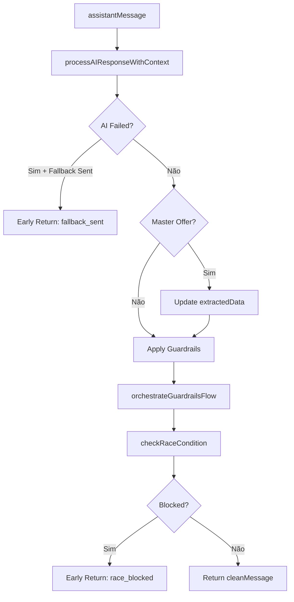

# Módulo: Response Finalization Phase

## Propósito

Processa a resposta do LLM antes do envio: aplica guardrails de segurança, verifica race conditions de proposta e trata falhas de AI.

## Fase no Pipeline

- **Número da Fase:** 14
- **Tipo:** Determinístico
- **Layer:** Response
- **Prioridade:** Média

## Interface

### Context (Entrada)

| Campo | Tipo | Obrigatório | Descrição |
|-------|------|-------------|-----------|
| `supabase` | `SupabaseClient` | ✅ | Cliente Supabase |
| `conversaId` | `string` | ✅ | ID da conversa |
| `phone` | `string` | ✅ | Telefone do cliente |
| `clienteNome` | `string \| null?` | ❌ | Nome do cliente |
| `messageText` | `string` | ✅ | Texto original |
| `assistantMessage` | `string` | ✅ | Resposta do LLM |
| `agentConfig` | `FullAgentConfig \| null?` | ❌ | Config do agente |
| `conversa` | `ResponseFinalizationConversaData \| null?` | ❌ | Dados |
| `existingDados` | `Record<string, unknown>` | ✅ | Dados existentes |
| `extractedData` | `Record<string, unknown>` | ✅ | Dados extraídos |
| `proposalUrl` | `string \| null?` | ❌ | URL da proposta |
| `sendWhatsAppMessage` | `function` | ✅ | Função de envio |

### Result (Saída)

| Campo | Tipo | Descrição |
|-------|------|-----------|
| `handled` | `boolean` | Se retornou early |
| `response` | `Response?` | HTTP response |
| `cleanMessage` | `string` | Mensagem limpa |
| `aiFailedCompletely` | `boolean` | Se AI falhou |
| `needsHumanEscalation` | `boolean` | Se precisa humano |
| `masterOfferDetected` | `boolean` | Se oferta master detectada |
| `updatedExtractedData` | `Record<string, unknown>?` | Dados atualizados |
| `guardrailsApplied` | `boolean` | Se guardrails aplicados |
| `raceConditionBlocked` | `boolean` | Se bloqueado por race |

## Fluxo Interno



## Dependências

| Módulo | Descrição |
|--------|-----------|
| `response-processing.ts` | Processamento de resposta |
| `llm-guardrails.ts` | Guardrails de segurança |
| `detection-patterns.ts` | Cache de padrões |

## AI Response Processing

Processa resposta do LLM e detecta:
- Falhas de AI (resposta vazia, erro)
- Necessidade de escalação
- Promessas de oferta master
- Informações conflitantes

## Guardrails

### Regras Aplicadas

| Regra | Descrição | Ação |
|-------|-----------|------|
| `no_competitor_mention` | Não mencionar concorrentes | Remove menção |
| `no_price_guarantee` | Não garantir preços | Generaliza |
| `no_timeline_promise` | Não prometer prazos | Adiciona "estimado" |
| `no_personal_info` | Não pedir dados sensíveis | Remove solicitação |

### Aplicação

```typescript
const guardrailsResult = await applyGuardrailsFlow(
  supabase,
  conversaId,
  cleanMessage,
  clienteNome,
  extractedData,
  agentName,
  conversa
);

// guardrailsResult = {
//   cleanMessage: 'Mensagem corrigida...',
//   modified: true
// }
```

## Race Condition Check

Verifica se proposta foi enviada durante processamento:

```typescript
const raceCheck = await checkRaceCondition(supabase, conversaId, cleanMessage);

if (raceCheck.blocked) {
  // Proposta foi enviada por outro processo
  // Mensagem não deve ser enviada
  return { handled: true, raceConditionBlocked: true };
}
```

## AI Failure Handling

Quando AI falha, envia fallback contextual:

```typescript
if (responseResult.aiFailedCompletely && responseResult.messageSentDirectly) {
  // Fallback já enviado
  // Sofia continua operando (não pausa)
  return { 
    handled: true, 
    aiFailedCompletely: true,
    cleanMessage: responseResult.cleanMessage 
  };
}
```

## Proposal URL Extraction

Extrai URL de proposta de múltiplas fontes:

```typescript
const proposalUrl = extractProposalUrl(extractedData, existingDados);

// Ordem de prioridade:
// 1. extractedData.proposal_url
// 2. extractedData.public_proposal_url
// 3. extractedData.proposta_url
// 4. existingDados.proposal_url
// ...
```

## Exemplos de Uso

### Processamento Normal

```typescript
const result = await executeResponseFinalizationPhase({
  supabase,
  conversaId: '...',
  assistantMessage: 'Olá João! Sua economia seria de 25%...',
  // ...
});

// result.handled = false
// result.cleanMessage = 'Olá João! Sua economia seria de 25%...'
// result.guardrailsApplied = false
```

### Guardrail Aplicado

```typescript
const result = await executeResponseFinalizationPhase({
  assistantMessage: 'A instalação será feita em 7 dias exatos.',
  // ...
});

// result.cleanMessage = 'A instalação será feita em aproximadamente 7 dias.'
// result.guardrailsApplied = true
```

### Race Condition

```typescript
// Outro processo enviou proposta durante LLM
const result = await executeResponseFinalizationPhase({
  assistantMessage: '',
  // ...
});

// result.handled = true
// result.raceConditionBlocked = true
```

## Métricas

- **Log prefix:** `[RESPONSE_FINALIZATION]`
- **Métricas importantes:**
  - Taxa de guardrails aplicados
  - Taxa de AI failures
  - Taxa de race conditions

## Histórico de Mudanças

| Data | Versão | Descrição |
|------|--------|-----------|
| 2024-03-20 | 1.0 | Extração do sofia-webhook |
| 2024-04-10 | 1.1 | Guardrails flow melhorado |
| 2024-05-01 | 1.2 | Race condition check |

---

**Autor:** Sofia Team  
**Última atualização:** 2026-02-03
