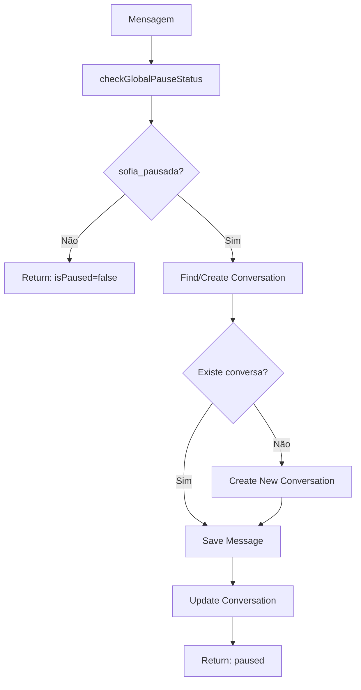

# Módulo: Global Pause Phase

## Propósito

Verifica se a Sofia está globalmente pausada (desabilitada pelo admin) e salva mensagens sem processamento quando desabilitada.

## Fase no Pipeline

- **Número da Fase:** 15
- **Tipo:** Determinístico
- **Layer:** Initialization
- **Prioridade:** Baixa

## Interface

### Context (Entrada)

| Campo | Tipo | Obrigatório | Descrição |
|-------|------|-------------|-----------|
| `supabase` | `SupabaseClient` | ✅ | Cliente Supabase |
| `phone` | `string` | ✅ | Telefone do cliente |
| `agentId` | `string` | ✅ | ID do agente |
| `clienteNome` | `string \| null?` | ❌ | Nome do cliente |
| `messageText` | `string` | ✅ | Texto da mensagem |
| `messageId` | `string \| null?` | ❌ | ID da mensagem |
| `getABVariant` | `function` | ✅ | Função de variante A/B |

### Result (Saída)

| Campo | Tipo | Descrição |
|-------|------|-----------|
| `handled` | `boolean` | Se retornou early |
| `response` | `Response?` | HTTP response |
| `isPaused` | `boolean` | Se está pausada |

## Fluxo Interno



## Dependências

| Módulo | Descrição |
|--------|-----------|
| `webhook-types.ts` | CORS headers |

## Global Pause Status

Configuração em `configuracoes_sistema`:

```typescript
const { data: pauseConfig } = await supabase
  .from('configuracoes_sistema')
  .select('valor')
  .eq('chave', 'sofia_pausada')
  .maybeSingle();

const isPaused = pauseConfig?.valor === 'true';
```

## Message Saving While Paused

Quando pausada, Sofia:
1. Encontra ou cria conversa
2. Salva mensagem do usuário
3. Atualiza timestamps
4. Não processa nem responde

```typescript
await saveMessageWhilePaused(
  supabase,
  phone,
  agentId,
  clienteNome,
  messageText,
  messageId,
  getABVariant
);
```

## Race Condition Handling

Trata unique constraint ao criar conversa:

```typescript
if (createError?.code === '23505') {
  // Outra instância criou a conversa
  // Busca a conversa existente
  const { data: raceConversa } = await supabase
    .from('chatbot_conversas')
    .select('id')
    .eq('cliente_telefone', phone)
    .eq('agent_id', agentId)
    .maybeSingle();
}
```

## Conversation Updates

Quando mensagem é salva, atualiza:

```typescript
await supabase
  .from('chatbot_conversas')
  .update({
    last_message_at: new Date().toISOString(),
    awaiting_response: false,
    nudge_count: 0,
    next_nudge_at: null,
    total_messages: count,
  })
  .eq('id', conversaId);
```

## Exemplos de Uso

### Sofia Ativa

```typescript
const result = await executeGlobalPausePhase({
  supabase,
  phone: '5511999999999',
  agentId: 'sofia',
  messageText: 'Olá',
  getABVariant,
});

// result.handled = false
// result.isPaused = false
// Continua para próximas fases
```

### Sofia Pausada

```typescript
// Admin setou sofia_pausada = 'true'
const result = await executeGlobalPausePhase({
  supabase,
  phone: '5511999999999',
  agentId: 'sofia',
  messageText: 'Olá',
  getABVariant,
});

// result.handled = true
// result.isPaused = true
// result.response = { status: 'paused', message_saved: true }
// Mensagem salva, mas não processada
```

## Quando Usar

- Manutenção programada
- Problemas técnicos
- Atualizações críticas
- Treinamento de operadores

## Reativação

Para reativar:

```sql
UPDATE configuracoes_sistema 
SET valor = 'false' 
WHERE chave = 'sofia_pausada';
```

Mensagens recebidas durante pausa ficam salvas e podem ser processadas manualmente ou em batch depois.

## Métricas e Observabilidade

- **Log prefix:** `[GLOBAL_PAUSE]`
- **Phase index:** 1 (PHASE_INDICES.global_pause)
- **Métricas coletadas:**
  - `duration_ms`: Tempo de execução da fase
  - `handled`: Se a fase tratou a mensagem (Sofia pausada)
  - `action`: `continue` ou `message_saved_while_paused`
  - `metadata.isPaused`: Status de pausa
  - `metadata.messageSaved`: Se a mensagem foi salva
  - `metadata.conversaId`: ID da conversa (se aplicável)

### Integração com PhaseMetricsCollector

```typescript
// Uso com métricas
const { collector, traceId } = initializeObservability({
  agentId: 'sofia',
  conversaId: conversa?.id,
});

const result = await executeGlobalPausePhase({
  supabase,
  phone,
  agentId,
  messageText,
  getABVariant,
  metrics: collector, // Opcional
});

// Ao final do request
await persistAllMetrics(supabase, collector);
```

## Histórico de Mudanças

| Data | Versão | Descrição |
|------|--------|-----------|
| 2024-03-25 | 1.0 | Extração do sofia-webhook |
| 2024-04-15 | 1.1 | Race condition handling |
| 2024-05-05 | 1.2 | Conversation updates |
| 2026-02-03 | 2.0 | Integração com PhaseMetricsCollector |

---

**Autor:** Sofia Team  
**Última atualização:** 2026-02-03
