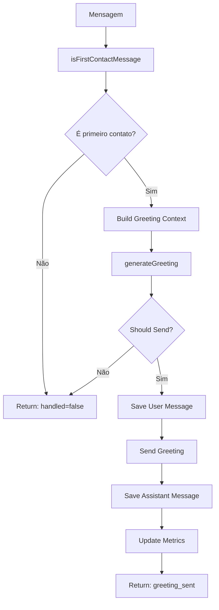

# Módulo: Greeting Phase

## Propósito

Envia saudação inicial personalizada para novos contatos, com mensagem de boas-vindas que apresenta a Sofia e inicia o atendimento.

## Fase no Pipeline

- **Número da Fase:** 16
- **Tipo:** Determinístico
- **Layer:** Fast-Paths
- **Prioridade:** Baixa

> **Correção (02/09/2026):** este doc dizia `Layer: Hard Stops`, mas o código não confirma isso.
> `executeGreetingPhase` é chamado em `sofia-webhook/index.ts:1396`, **depois** dos hard stops
> reais de LAYER 2 (operator commands `:1003`, global pause `:1046`, lifecycle/manual-mode `:1076`)
> e **antes** do bloco que o próprio código nomeia `CRITICAL: PRE-LLM HARD STOPS - Phase 85`
> (`:1626`, regras de negócio: valor mínimo de fatura, bloqueio de re-entrada, bypass de triagem,
> exigência de e-mail — nada relacionado a greeting). Greeting roda como fast-path determinístico
> antes do LLM, exatamente como `sofia-webhook/README.md` já descreve em `LAYER 3: FAST-PATHS`.

## Interface

### Context (Entrada)

| Campo | Tipo | Obrigatório | Descrição |
|-------|------|-------------|-----------|
| `supabase` | `SupabaseClient` | ✅ | Cliente Supabase |
| `conversaId` | `string` | ✅ | ID da conversa |
| `phone` | `string` | ✅ | Telefone do cliente |
| `clienteNome` | `string \| null?` | ❌ | Nome do cliente |
| `messageText` | `string` | ✅ | Texto da mensagem |
| `messageId` | `string \| null?` | ❌ | ID da mensagem |
| `totalMessages` | `number` | ✅ | Total de mensagens |
| `hasBitrixLead` | `boolean` | ✅ | Se tem lead Bitrix |
| `agentName` | `string` | ✅ | Nome do agente |
| `sendWhatsAppMessage` | `function` | ✅ | Função de envio |

### Result (Saída)

| Campo | Tipo | Descrição |
|-------|------|-----------|
| `handled` | `boolean` | Se enviou greeting |
| `response` | `Response?` | HTTP response |
| `greetingType` | `string?` | Tipo de saudação |
| `greetingSent` | `boolean?` | Se foi enviada |
| `infoRequestDetected` | `boolean?` | Se detectou pedido de info |

## Fluxo Interno



## Dependências

| Módulo | Descrição |
|--------|-----------|
| `greeting-handler.ts` | Geração de saudações |
| `webhook-types.ts` | CORS headers |

## First Contact Detection

```typescript
function isFirstContactMessage(
  totalMessages: number,
  hasBitrixLead: boolean
): boolean {
  return totalMessages <= 1 && !hasBitrixLead;
}
```

## Greeting Types

| Tipo | Trigger | Mensagem |
|------|---------|----------|
| `welcome` | Primeira msg genérica | Apresentação completa |
| `info_request` | "como funciona?" | Resposta + apresentação |
| `returning` | Cliente com lead antigo | Boas-vindas de volta |

## Greeting Generation

```typescript
const greetingResult = generateGreeting({
  conversaId,
  phone,
  clienteNome,
  totalMessages,
  isNewConversation: totalMessages === 0,
  agentName,
  userMessage: messageText,
});

// greetingResult = {
//   shouldSendGreeting: true,
//   greetingMessage: 'Olá! 👋 Sou a sofIA...',
//   greetingType: 'welcome'
// }
```

## Message Flow

1. **Salva mensagem do usuário**
2. **Envia greeting**
3. **Salva greeting como assistant**
4. **Atualiza métricas**

```typescript
// 1. Save user message
await supabase.from('chatbot_mensagens').insert({
  conversa_id: conversaId,
  role: 'user',
  content: messageText,
});

// 2. Send greeting
await sendWhatsAppMessage(phone, greetingMessage);

// 3. Save greeting
await supabase.from('chatbot_mensagens').insert({
  conversa_id: conversaId,
  role: 'assistant',
  content: greetingMessage,
});

// 4. Update metrics
await supabase.from('chatbot_conversas').update({
  last_sofia_message_at: new Date().toISOString(),
  total_messages: totalMessages + 2,
});
```

## Exemplos de Uso

### Primeiro Contato

```typescript
const result = await executeGreetingPhase({
  supabase,
  conversaId: '...',
  phone: '5511999999999',
  messageText: 'Oi',
  totalMessages: 1,
  hasBitrixLead: false,
  agentName: 'sofIA',
  sendWhatsAppMessage,
});

// result.handled = true
// result.greetingSent = true
// result.greetingType = 'welcome'
// Greeting enviado, aguardando resposta
```

### Info Request

```typescript
const result = await executeGreetingPhase({
  messageText: 'Como funciona energia solar?',
  totalMessages: 1,
  // ...
});

// result.handled = true
// result.infoRequestDetected = true
// Greeting com resposta inicial
```

### Não é Primeiro Contato

```typescript
const result = await executeGreetingPhase({
  totalMessages: 5, // Já conversou antes
  // ...
});

// result.handled = false
// result.greetingSent = false
// Continua para próximas fases
```

## Métricas

- **Log prefix:** `[GREETING_PHASE]`
- **Métricas importantes:**
  - Taxa de greetings enviados
  - Distribuição por tipo
  - Taxa de info requests

## Histórico de Mudanças

| Data | Versão | Descrição |
|------|--------|-----------|
| 2024-03-30 | 1.0 | Extração do sofia-webhook |
| 2024-04-20 | 1.1 | Info request detection |
| 2024-05-10 | 1.2 | Greeting types expandidos |

---

**Autor:** Sofia Team  
**Última atualização:** 2026-02-03
