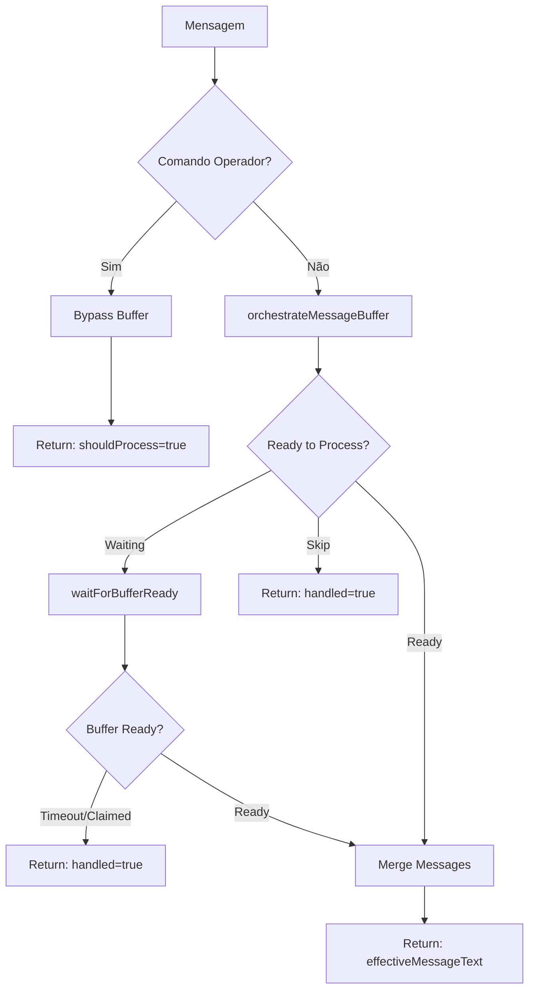

# Módulo: Message Buffer Phase

## Propósito

Acumula mensagens rápidas em sequência (phantom enter) e processa como contexto único, evitando múltiplas respostas fragmentadas e humanizando o atendimento.

## Fase no Pipeline

- **Número da Fase:** 17
- **Tipo:** Determinístico
- **Layer:** Fast-Paths
- **Prioridade:** Baixa

## Relação com Pipeline v2

> **Adicionado 02/09/2026** — relação entre este módulo e `_shared/pipeline/` (Pipeline v2)
> não estava documentada em lugar nenhum; confirmado lendo `sofia-webhook/index.ts`.

Não são sistemas paralelos independentes — é uma dependência sequencial de mão única:

1. **Message Buffer Phase roda primeiro, sempre**, incondicionalmente, para toda mensagem
   recebida (`index.ts:742-893`, LAYER 1 do fluxo em `README.md`). Produz `effectiveMessageText`
   (texto já agregado/mergeado da janela de silêncio).
2. **Esse `effectiveMessageText` é o input** tanto para o Pipeline v2 (`index.ts:940`) quanto
   para o fluxo legado (orchestrator phases: operator commands, greeting-phase, hard stops etc.).
3. Logo depois do buffer (`index.ts:907`), o código decide **qual caminho processa** esse texto:
   Pipeline v2 é tentado primeiro *apenas se* houver conversa já existente (`if (conversaId)`,
   `index.ts:928`); se tiver sucesso, retorna direto (`index.ts:966`) e o fluxo legado (greeting,
   hard stops, LLM reasoning) nunca roda. Se falhar ou não houver conversa existente, cai para o
   fluxo legado normalmente.

Ou seja: Message Buffer Phase não "compartilha dados" com Pipeline v2 no sentido de troca
bidirecional — ele é a etapa upstream comum que alimenta a bifurcação Pipeline v2 vs. legado.
Pipeline v2 e o orquestrador legado (fases 0-18) são alternativas entre si (tentativa + fallback),
não sistemas paralelos.

## Interface

### Context (Entrada)

| Campo | Tipo | Obrigatório | Descrição |
|-------|------|-------------|-----------|
| `supabaseUrl` | `string` | ✅ | URL do Supabase |
| `supabaseKey` | `string` | ✅ | Service key |
| `phone` | `string` | ✅ | Telefone do cliente |
| `agentId` | `string` | ✅ | ID do agente |
| `messageText` | `string` | ✅ | Texto da mensagem |
| `messageId` | `string \| null` | ❌ | ID da mensagem |
| `isOperatorCommand` | `boolean` | ✅ | Se é comando de operador |

### Result (Saída)

| Campo | Tipo | Descrição |
|-------|------|-----------|
| `handled` | `boolean` | Se buffer resolveu |
| `shouldProcess` | `boolean` | Se deve processar |
| `effectiveMessageText` | `string` | Texto efetivo (merged) |
| `bufferResult` | `BufferOrchestrationResult \| null` | Resultado do buffer |
| `response` | `Response?` | HTTP response |
| `reason` | `string?` | Razão do resultado |

## Fluxo Interno



## Dependências

| Módulo | Descrição |
|--------|-----------|
| `message-buffer.ts` | Orquestração de buffer |
| `webhook-types.ts` | CORS headers |

## Buffer Constants

```typescript
const MAX_BUFFER_WAIT_MS = 20000;  // Máximo de espera
const POLL_INTERVAL_MS = 500;      // Intervalo de poll
const SILENCE_WINDOW_MS = 2000;    // Janela de silêncio
```

## Operator Command Bypass

Comandos de operador pulam o buffer completamente:

```typescript
if (isOperatorCommand) {
  return {
    handled: false,
    shouldProcess: true,
    effectiveMessageText: messageText,
    bufferResult: {
      shouldProcess: true,
      reason: 'operator_command_bypass',
      mergedText: messageText,
    },
  };
}
```

## Buffer Orchestration

```typescript
const bufferResult = await orchestrateMessageBuffer({
  supabaseUrl,
  supabaseKey,
  phone,
  agentId,
  messageText,
  messageId,
  timestamp: new Date(),
});

// bufferResult = {
//   shouldProcess: true,
//   reason: 'silence_window_elapsed',
//   mergedText: 'Olá\nMeu nome é João\nQuero economizar',
//   messageCount: 3,
//   phantomEnterDetected: true,
//   bufferId: 'uuid...',
// }
```

## Phantom Enter Detection

Detecta quando cliente envia várias mensagens curtas em sequência:

```
Cliente: Olá
Cliente: Meu nome é João
Cliente: Quero economizar na conta de luz
```

Resultado merged:
```
Olá
Meu nome é João
Quero economizar na conta de luz
```

## Wait for Buffer Ready

Quando buffer ainda está aguardando mais mensagens:

```typescript
const waitResult = await waitForBufferReady(
  supabaseUrl,
  supabaseKey,
  phone,
  agentId,
  MAX_BUFFER_WAIT_MS,
  POLL_INTERVAL_MS
);
```

## Skip Reasons

| Razão | Descrição |
|-------|-----------|
| `operator_command_bypass` | Comando de operador |
| `already_processing` | Outra instância processando |
| `buffer_claimed` | Buffer claim por outra instância |
| `timeout` | Timeout de espera |
| `buffer_error_fallback` | Erro no buffer, usa msg original |

## Exemplos de Uso

### Mensagens Rápidas

```typescript
// Cliente envia 3 msgs em 2 segundos
// Primeira instância recebe "Olá"
const result1 = await executeMessageBufferPhase({
  messageText: 'Olá',
  isOperatorCommand: false,
  // ...
});
// result1.shouldProcess = false (waiting)

// Após silence window
const result2 = await executeMessageBufferPhase({
  // ...
});
// result2.shouldProcess = true
// result2.effectiveMessageText = 'Olá\nMeu nome é João\nQuero economizar'
// result2.bufferResult.messageCount = 3
// result2.bufferResult.phantomEnterDetected = true
```

### Comando de Operador

```typescript
const result = await executeMessageBufferPhase({
  messageText: '#ASSUMIR',
  isOperatorCommand: true,
  // ...
});

// result.shouldProcess = true
// result.reason = 'operator_command_bypass'
// Processado imediatamente
```

### Buffer Error

```typescript
// Erro de conexão com banco
const result = await executeMessageBufferPhase({
  // ...
});

// result.shouldProcess = true
// result.reason = 'buffer_error_fallback'
// Usa mensagem original, não bloqueia
```

## Métricas

- **Log prefix:** `[BUFFER]`
- **Métricas importantes:**
  - Taxa de phantom enter
  - Média de mensagens por buffer
  - Taxa de buffer claims

## Histórico de Mudanças

| Data | Versão | Descrição |
|------|--------|-----------|
| 2024-04-01 | 1.0 | Extração do sofia-webhook |
| 2024-04-25 | 1.1 | Operator command bypass |
| 2024-05-15 | 1.2 | Error fallback melhorado |

---

**Autor:** Sofia Team  
**Última atualização:** 2026-02-03
