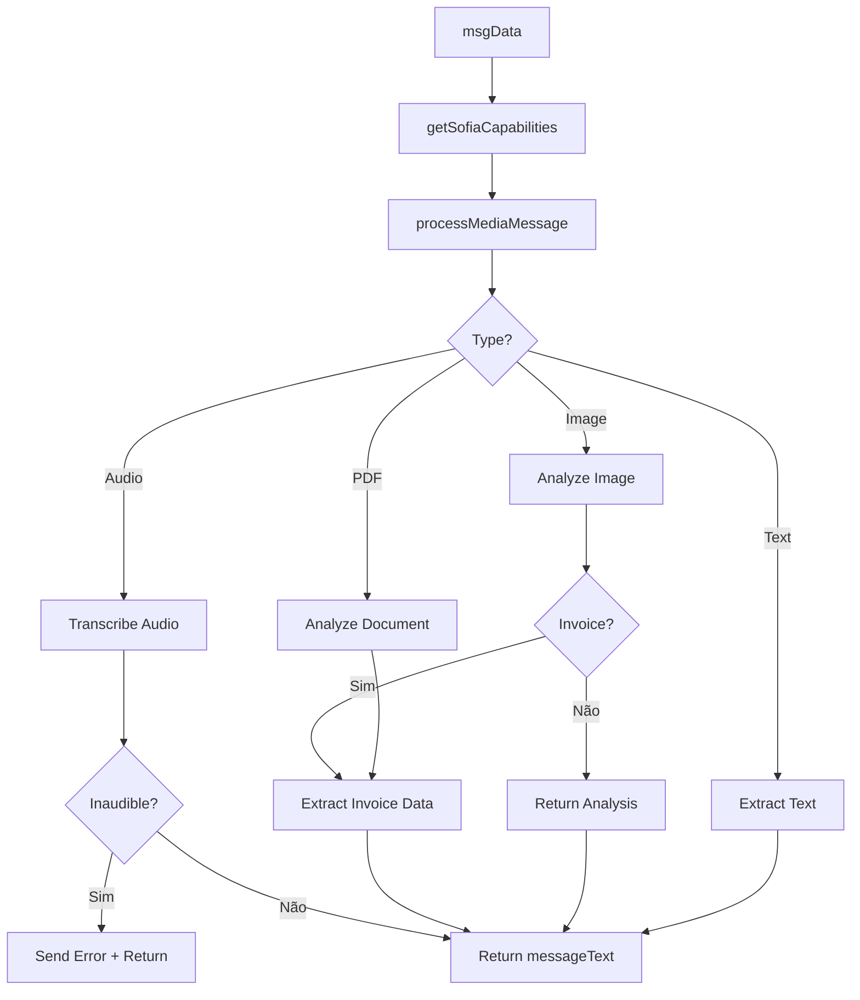

# Módulo: Media Processing Phase

## Propósito

Processa mensagens de mídia: transcreve áudios, analisa imagens (faturas), analisa PDFs e detecta conteúdo relevante como faturas de energia.

## Fase no Pipeline

- **Número da Fase:** 18
- **Tipo:** Híbrido (Determinístico + AI Vision/Speech)
- **Layer:** Intake
- **Prioridade:** Baixa

## Interface

### Context (Entrada)

| Campo | Tipo | Obrigatório | Descrição |
|-------|------|-------------|-----------|
| `supabase` | `SupabaseClient` | ✅ | Cliente Supabase |
| `msgData` | `MessageData` | ✅ | Dados da mensagem |
| `phone` | `string` | ✅ | Telefone do cliente |
| `clienteNome` | `string \| null` | ❌ | Nome do cliente |
| `agentId` | `string` | ✅ | ID do agente |
| `sendWhatsAppMessage` | `function` | ✅ | Função de envio |

### Result (Saída)

| Campo | Tipo | Descrição |
|-------|------|-----------|
| `handled` | `boolean` | Se retornou early |
| `response` | `Response?` | HTTP response |
| `messageText` | `string \| null` | Texto extraído |
| `isTranscribedAudio` | `boolean` | Se é áudio transcrito |
| `isAnalyzedImage` | `boolean` | Se é imagem analisada |
| `isAnalyzedDocument` | `boolean` | Se é documento analisado |
| `detectedInvoice` | `boolean` | Se detectou fatura |
| `mediaAnalysisResult` | `object \| null` | Resultado da análise |

## Fluxo Interno



## Dependências

| Módulo | Descrição |
|--------|-----------|
| `media-message-processor.ts` | Processamento de mídia |
| `audio-handler.ts` | Capabilities de áudio |
| `message-templates.ts` | Templates de mensagens |
| `webhook-types.ts` | CORS headers |

## Sofia Capabilities

```typescript
const sofiaCapabilities = await getSofiaCapabilities(supabase);

// sofiaCapabilities = {
//   audioTranscription: true,
//   imageAnalysis: true,
//   pdfAnalysis: true,
//   audioSending: true,
// }
```

## Media Types

| Tipo | Ação | Resultado |
|------|------|-----------|
| `audio/ogg` | Transcrição Whisper | Texto falado |
| `image/jpeg` | Vision Analysis | Descrição + dados |
| `image/png` | Vision Analysis | Descrição + dados |
| `application/pdf` | PDF Parsing | Texto + dados |
| `text` | Passthrough | Texto original |

## Audio Transcription

```typescript
// Áudio inaudível
if (transcriptionResult.inaudible) {
  await sendWhatsAppMessage(phone, 
    'Não consegui entender o áudio. Poderia digitar ou tentar novamente?'
  );
  return { handled: true };
}

// Áudio transcrito
messageText = `[🎤 Áudio transcrito]: ${transcriptionResult.text}`;
```

## Image Analysis

### Invoice Detection

```typescript
const analysisResult = await analyzeImage(imageData);

if (analysisResult.isInvoice) {
  // Detectou fatura de energia
  // Extrai: valor, distribuidora, consumo, vencimento
}

// mediaAnalysisResult = {
//   analysis: 'Fatura de energia CEMIG...',
//   base64Data: '...',
//   mimeType: 'image/jpeg',
//   isInvoice: true,
// }
```

### Non-Invoice Images

```typescript
// Imagem genérica (selfie, documento, etc.)
messageText = `[📷 Imagem analisada]: ${analysisResult.description}`;
```

## PDF Analysis

```typescript
const pdfResult = await analyzePDF(pdfData);

// Extrai texto e detecta tipo
if (pdfResult.isInvoice) {
  // Fatura de energia em PDF
}

messageText = `[📄 PDF analisado]: ${pdfResult.summary}`;
```

## Capability Messages

Quando capability está desabilitada:

```typescript
const message = getMediaCapabilityMessage('audio', templateCache);
// "No momento não consigo ouvir áudios. Poderia digitar sua mensagem?"
```

## Exemplos de Uso

### Áudio Transcrito

```typescript
const result = await executeMediaProcessingPhase({
  msgData: {
    type: 'audio',
    audio: { mimeType: 'audio/ogg', data: '...' }
  },
  // ...
});

// result.messageText = '[🎤 Áudio transcrito]: Quero saber sobre energia solar'
// result.isTranscribedAudio = true
```

### Fatura Detectada

```typescript
const result = await executeMediaProcessingPhase({
  msgData: {
    type: 'image',
    image: { mimeType: 'image/jpeg', data: '...' }
  },
  // ...
});

// result.messageText = '[📷 Imagem analisada]: Fatura CEMIG R$ 450...'
// result.isAnalyzedImage = true
// result.detectedInvoice = true
// result.mediaAnalysisResult.isInvoice = true
```

### Sem Texto

```typescript
const result = await executeMediaProcessingPhase({
  msgData: { type: 'sticker' }, // Sticker não tem texto
  // ...
});

// result.handled = true
// result.messageText = null
// Retorna ignored
```

## Métricas

- **Log prefix:** `[MEDIA_PROCESSING]`
- **Métricas importantes:**
  - Taxa de transcrição de áudio
  - Taxa de detecção de faturas
  - Taxa de áudios inaudíveis

## Histórico de Mudanças

| Data | Versão | Descrição |
|------|--------|-----------|
| 2024-04-05 | 1.0 | Extração do sofia-webhook |
| 2024-05-01 | 1.1 | Invoice detection melhorado |
| 2024-05-20 | 1.2 | PDF analysis adicionado |

---

**Autor:** Sofia Team  
**Última atualização:** 2026-02-03
